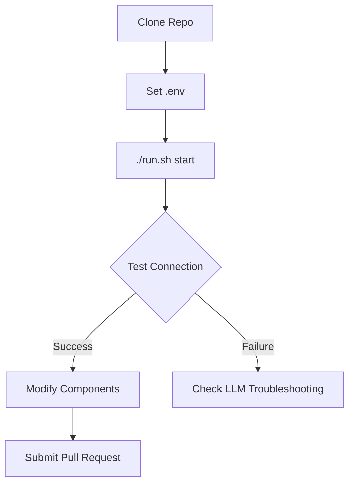

# NeuroSense FX - LLM Developer Guide

## 🧠 LLM-Optimized Project Overview
This guide provides LLM developers with everything needed to understand, run, and contribute to NeuroSense FX. The project combines:
- Real-time financial data visualization (Svelte frontend)
- cTrader API integration (Node.js backend)
- High-performance Canvas rendering
- WebSocket-based data streaming

## 🚀 LLM-Specific Quick Start

### Prerequisites
- Node.js v18+
- cTrader API credentials
- Basic understanding of financial markets

### One-Command Setup & Run
```bash
# Make script executable
chmod +x run.sh

# Start the application
./run.sh start
```

### Verification Checklist
1. Backend running: `http://localhost:8080` responds with "Upgrade Required" (WebSocket)
2. Frontend running: `http://localhost:5173` shows trading dashboard
3. No errors in terminal running `./run_neurosense.sh start`
4. Browser console shows WebSocket connection established
5. **Windows Users**: Use Git Bash or WSL for the chmod command, or run `bash run_neurosense.sh start`

## 🧩 Key Files for LLM Understanding
1. [`src/components/viz/Container.svelte`](src/components/viz/Container.svelte) - Main visualization component
2. [`src/data/wsClient.js`](src/data/wsClient.js) - WebSocket client for real-time data
3. [`services/tick-backend/CTraderSession.js`](services/tick-backend/CTraderSession.js) - cTrader API integration
4. [`src/workers/dataProcessor.js`](src/workers/dataProcessor.js) - Background data processing

## 💡 LLM Cheat Sheet
```markdown
1. START:        ./run.sh start
2. STOP:         ./run.sh stop
3. LOGS:         ./run.sh logs
4. SIMULATE:     Modify `src/data/wsClient.js` to use mock data
5. DEBUG:        Add console logs to `CTraderSession.js` connection handlers
```

## 🐞 LLM-Specific Troubleshooting

### Authentication Issues
```bash
# Verify .env file exists in ctrader_tick_backend
ls ctrader_tick_backend/.env

# Check credentials format
cat ctrader_tick_backend/.env
# Should contain:
# CTRADER_CLIENT_ID=your_id
# CTRADER_SECRET=your_secret
# CTRADER_ACCESS_TOKEN=your_token
```

### Data Not Displaying
1. Check browser console for WebSocket errors
2. Verify backend is running: `curl http://localhost:8080`
3. Check symbol subscriptions in [`SymbolSubscription.js`](services/tick-backend/src/subscription/SymbolSubscription.js)

### Windows-Specific Issues
```bash
# If chmod command fails on Windows, use:
bash run.sh start

# Or use the unified script:
./run.sh start
```

### Port Already in Use
```bash
# Kill processes using ports 8080 or 5173
lsof -ti:8080 | xargs kill -9
lsof -ti:5173 | xargs kill -9
```

### Performance Optimization Tips
```javascript
// In src/workers/dataProcessor.js:
// Adjust these parameters for LLM development
const PROCESSING_BATCH_SIZE = 50;  // Reduce for faster updates
const THROTTLE_INTERVAL = 100;     // Increase for lower CPU usage
```

## 🧪 Testing Framework
```bash
# Run backend tests
cd services/tick-backend
npm test

# Run frontend tests
npm run test
```

## 📚 Recommended Exploration Path
1. Start with market simulation (`src/data/wsClient.js`)
2. Modify visualization parameters (`src/lib/viz/marketPulse.js`)
3. Add new indicators (`src/lib/viz/volatilityMetric.js`)
4. Integrate new data sources (`services/tick-backend/stream-real.cjs`)

## 🤖 LLM Development Workflow


## ❓ FAQ for LLM Developers
**Q: How do I simulate market data without real cTrader account?**  
A: Set `USE_SIMULATION=true` in `src/data/wsClient.js`

**Q: Where do I add new technical indicators?**  
A: Create new files in `src/lib/viz/` and import in `Container.svelte`

**Q: How to debug WebSocket issues?**  
A: Use `DEBUG=websocket node server.js` in services/tick-backend directory

**Q: What's the safest way to modify rendering?**  
A: Start with `src/lib/viz/priceDisplay.js` - isolated rendering component