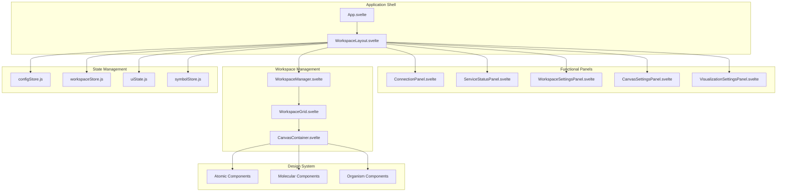
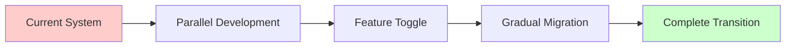
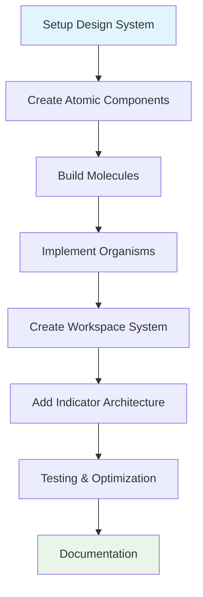

# NeuroSense FX - New UI Architecture Plan

## Executive Summary

This document outlines the comprehensive plan for implementing a new UI architecture for NeuroSense FX, a professional trading application. The plan addresses the current limitations while introducing a modular, scalable, and performance-optimized architecture that supports the complex requirements of real-time financial data visualization.

## 1. Current State Analysis

### 1.1 Current Architecture Strengths
- **High-performance Canvas rendering** for visualizations
- **Web Worker architecture** for data processing
- **Real-time WebSocket integration** with cTrader API
- **Modular visualization components** in `src/lib/viz/`
- **Svelte-based reactive state management**

### 1.2 Current Architecture Pain Points
1. **Monolithic ConfigPanel**: All settings in one 750+ line component
2. **Tight coupling**: Configuration and visualization logic intertwined
3. **No workspace persistence**: Settings lost on refresh
4. **Limited layout flexibility**: Fixed 3-column layout
5. **No design system**: Inconsistent styling and components
6. **Scalability issues**: Adding new features requires modifying large components

### 1.3 Current File Structure Analysis
```
src/
├── components/
│   ├── ConfigPanel.svelte (753 lines - too large)
│   ├── FXSymbolSelector.svelte
│   └── viz/
│       ├── Container.svelte (159 lines)
│       └── MultiSymbolADR.svelte
├── data/
│   ├── schema.js (224 lines - good separation)
│   ├── symbolStore.js (152 lines)
│   └── wsClient.js (301 lines)
├── stores/
│   ├── configStore.js (132 lines)
│   ├── uiState.js (5 lines - minimal)
│   └── markerStore.js
└── lib/viz/ (well-structured visualization modules)
```

## 2. New Modular UI Architecture

### 2.1 High-Level Architecture Overview



### 2.2 New File Structure

```
src/
├── components/
│   ├── atoms/                    # Atomic design components
│   │   ├── Button.svelte
│   │   ├── Input.svelte
│   │   ├── Label.svelte
│   │   ├── Badge.svelte
│   │   ├── Icon.svelte
│   │   ├── Checkbox.svelte
│   │   ├── Radio.svelte
│   │   ├── Slider.svelte
│   │   └── index.js              # Barrel exports
│   ├── molecules/                # Simple combinations of atoms
│   │   ├── PriceDisplay.svelte
│   │   ├── SymbolBadge.svelte
│   │   ├── StatusIndicator.svelte
│   │   ├── FormField.svelte
│   │   ├── SearchInput.svelte
│   │   ├── MetricCard.svelte
│   │   └── index.js
│   ├── organisms/                # Complex, feature-complete components
│   │   ├── panels/
│   │   │   ├── ConnectionPanel.svelte
│   │   │   ├── ServiceStatusPanel.svelte
│   │   │   ├── WorkspaceSettingsPanel.svelte
│   │   │   ├── CanvasSettingsPanel.svelte
│   │   │   └── VisualizationSettingsPanel.svelte
│   │   ├── workspace/
│   │   │   ├── WorkspaceManager.svelte
│   │   │   ├── WorkspaceGrid.svelte
│   │   │   ├── CanvasContainer.svelte
│   │   │   └── WorkspaceToolbar.svelte
│   │   ├── SymbolSelector.svelte
│   │   └── index.js
│   ├── templates/                # Page-level layouts
│   │   ├── DashboardLayout.svelte
│   │   ├── TradingWorkspace.svelte
│   │   └── index.js
│   └── viz/                      # Existing canvas visualizations (enhanced)
│       ├── Container.svelte      # Refactored to use new architecture
│       ├── MultiSymbolADR.svelte
│       └── indicators/           # New modular indicator system
│           ├── MarketProfile.svelte
│           ├── VolatilityOrb.svelte
│           ├── PriceFloat.svelte
│           └── index.js
├── design/                       # Design system foundation
│   ├── tokens.js                 # Design tokens
│   ├── tokens.css                # CSS variables
│   ├── global.css                # Global styles
│   └── index.js                  # Design system exports
├── stores/                       # Enhanced state management
│   ├── configStore.js            # Refactored for modularity
│   ├── workspaceStore.js         # NEW: Workspace management
│   ├── uiState.js                # Enhanced UI state
│   ├── symbolStore.js            # Existing (minimal changes)
│   └── index.js                  # Store exports
├── utils/                        # Utility functions
│   ├── workspace.js              # Workspace persistence
│   ├── canvas.js                 # Canvas utilities
│   ├── performance.js            # Performance monitoring
│   └── index.js
└── data/                         # Existing data layer (minimal changes)
    ├── schema.js
    ├── symbolStore.js
    └── wsClient.js
```

## 3. Workspace Management System

### 3.1 Workspace Data Structure

```javascript
// src/stores/workspaceStore.js

import { writable, derived } from 'svelte/store';
import { persist } from '../utils/persistence.js';

/**
 * Workspace definition
 * @typedef {Object} Workspace
 * @property {string} id - Unique identifier
 * @property {string} name - Display name
 * @property {string} description - Optional description
 * @property {Date} createdAt - Creation timestamp
 * @property {Date} updatedAt - Last modification timestamp
 * @property {WorkspaceLayout} layout - Canvas layout configuration
 * @property {Object} globalSettings - Global canvas settings
 * @property {Array} symbolSubscriptions - Active symbol subscriptions
 * @property {Object} visualizationSettings - Per-symbol visualization settings
 */

/**
 * Canvas layout configuration
 * @typedef {Object} WorkspaceLayout
 * @property {Array} canvases - Array of canvas configurations
 * @property {Object} gridSettings - Grid layout settings
 * @property {Object} viewSettings - Zoom, pan, etc.
 */

/**
 * Canvas configuration
 * @typedef {Object} CanvasConfig
 * @property {string} id - Unique canvas identifier
 * @property {string} symbol - Tracked symbol
 * @property {Object} position - X, Y coordinates
 * @property {Object} size - Width, height
 * @property {Object} settings - Canvas-specific settings
 * @property {Array} indicators - Active indicators
 * @property {boolean} isVisible - Visibility state
 * @property {number} zIndex - Stacking order
 */

// Default workspace structure
const createDefaultWorkspace = () => ({
  id: `workspace_${Date.now()}`,
  name: 'Default Workspace',
  description: 'Default trading workspace',
  createdAt: new Date(),
  updatedAt: new Date(),
  layout: {
    canvases: [],
    gridSettings: {
      columns: 4,
      rows: 3,
      gap: 10,
      padding: 20
    },
    viewSettings: {
      zoom: 1,
      panX: 0,
      panY: 0
    }
  },
  globalSettings: {
    density: 'high',
    theme: 'dark',
    autoSave: true,
    autoSaveInterval: 30000 // 30 seconds
  },
  symbolSubscriptions: [],
  visualizationSettings: {}
});

// Workspace store with persistence
const { subscribe, set, update } = writable(
  persist('neurosense_workspace', createDefaultWorkspace())
);

// Derived stores for specific workspace aspects
export const canvases = derived(
  subscribe,
  $workspace => $workspace.layout.canvases
);

export const symbolSubscriptions = derived(
  subscribe,
  $workspace => $workspace.symbolSubscriptions
);

export const globalSettings = derived(
  subscribe,
  $workspace => $workspace.globalSettings
);

// Workspace management functions
export const workspaceStore = {
  subscribe,
  
  /**
   * Create a new workspace
   * @param {Object} options - Workspace options
   * @returns {string} Workspace ID
   */
  createWorkspace(options = {}) {
    const workspace = {
      ...createDefaultWorkspace(),
      ...options,
      id: `workspace_${Date.now()}`,
      createdAt: new Date(),
      updatedAt: new Date()
    };
    
    set(workspace);
    return workspace.id;
  },
  
  /**
   * Add a canvas to the workspace
   * @param {Object} canvasConfig - Canvas configuration
   * @returns {string} Canvas ID
   */
  addCanvas(canvasConfig = {}) {
    const canvas = {
      id: `canvas_${Date.now()}`,
      symbol: 'EURUSD',
      position: { x: 0, y: 0 },
      size: { width: 220, height: 120 },
      settings: {},
      indicators: [],
      isVisible: true,
      zIndex: 0,
      ...canvasConfig
    };
    
    update(workspace => ({
      ...workspace,
      layout: {
        ...workspace.layout,
        canvases: [...workspace.layout.canvases, canvas]
      },
      updatedAt: new Date()
    }));
    
    return canvas.id;
  },
  
  /**
   * Update canvas configuration
   * @param {string} canvasId - Canvas ID
   * @param {Object} updates - Updates to apply
   */
  updateCanvas(canvasId, updates) {
    update(workspace => ({
      ...workspace,
      layout: {
        ...workspace.layout,
        canvases: workspace.layout.canvases.map(canvas =>
          canvas.id === canvasId ? { ...canvas, ...updates } : canvas
        )
      },
      updatedAt: new Date()
    }));
  },
  
  /**
   * Remove a canvas from the workspace
   * @param {string} canvasId - Canvas ID
   */
  removeCanvas(canvasId) {
    update(workspace => ({
      ...workspace,
      layout: {
        ...workspace.layout,
        canvases: workspace.layout.canvases.filter(canvas => canvas.id !== canvasId)
      },
      updatedAt: new Date()
    }));
  },
  
  /**
   * Reorder canvases
   * @param {Array} canvasIds - Ordered array of canvas IDs
   */
  reorderCanvases(canvasIds) {
    update(workspace => {
      const orderedCanvases = canvasIds.map(id =>
        workspace.layout.canvases.find(canvas => canvas.id === id)
      ).filter(Boolean);
      
      return {
        ...workspace,
        layout: {
          ...workspace.layout,
          canvases: orderedCanvases
        },
        updatedAt: new Date()
      };
    });
  },
  
  /**
   * Update global settings
   * @param {Object} settings - Settings to update
   */
  updateGlobalSettings(settings) {
    update(workspace => ({
      ...workspace,
      globalSettings: { ...workspace.globalSettings, ...settings },
      updatedAt: new Date()
    }));
  },
  
  /**
   * Add symbol subscription
   * @param {string} symbol - Symbol to subscribe
   */
  addSymbolSubscription(symbol) {
    update(workspace => {
      const subscriptions = workspace.symbolSubscriptions.includes(symbol)
        ? workspace.symbolSubscriptions
        : [...workspace.symbolSubscriptions, symbol];
      
      return {
        ...workspace,
        symbolSubscriptions: subscriptions,
        updatedAt: new Date()
      };
    });
  },
  
  /**
   * Remove symbol subscription
   * @param {string} symbol - Symbol to unsubscribe
   */
  removeSymbolSubscription(symbol) {
    update(workspace => ({
      ...workspace,
      symbolSubscriptions: workspace.symbolSubscriptions.filter(s => s !== symbol),
      updatedAt: new Date()
    }));
  },
  
  /**
   * Reset workspace to default
   */
  reset() {
    set(createDefaultWorkspace());
  },
  
  /**
   * Export workspace configuration
   * @returns {Object} Workspace configuration
   */
  export() {
    let workspace;
    subscribe(w => workspace = w)();
    return JSON.stringify(workspace, null, 2);
  },
  
  /**
   * Import workspace configuration
   * @param {string|Object} workspaceConfig - Workspace configuration
   */
  import(workspaceConfig) {
    try {
      const config = typeof workspaceConfig === 'string' 
        ? JSON.parse(workspaceConfig) 
        : workspaceConfig;
      
      set({
        ...createDefaultWorkspace(),
        ...config,
        updatedAt: new Date()
      });
    } catch (error) {
      console.error('Failed to import workspace:', error);
    }
  }
};
```

### 3.2 Workspace Persistence Utility

```javascript
// src/utils/persistence.js

/**
 * LocalStorage persistence utility
 * @param {string} key - Storage key
 * @param {*} defaultValue - Default value if not found
 * @returns {Function} Persist function
 */
export function persist(key, defaultValue) {
  try {
    const item = localStorage.getItem(key);
    return item ? JSON.parse(item) : defaultValue;
  } catch (error) {
    console.error(`Error loading ${key} from localStorage:`, error);
    return defaultValue;
  }
}

/**
 * Save data to localStorage
 * @param {string} key - Storage key
 * @param {*} data - Data to save
 */
export function save(key, data) {
  try {
    localStorage.setItem(key, JSON.stringify(data));
  } catch (error) {
    console.error(`Error saving ${key} to localStorage:`, error);
  }
}

/**
 * Auto-save utility for workspaces
 * @param {Function} store - Svelte store
 * @param {number} interval - Auto-save interval in milliseconds
 */
export function autoSave(store, interval = 30000) {
  let lastSaved = {};
  
  // Initial save
  store.subscribe(value => {
    save('neurosense_workspace', value);
    lastSaved = JSON.parse(JSON.stringify(value));
  });
  
  // Periodic save if changed
  setInterval(() => {
    let current;
    store.subscribe(value => current = value)();
    
    if (JSON.stringify(current) !== JSON.stringify(lastSaved)) {
      save('neurosense_workspace', current);
      lastSaved = JSON.parse(JSON.stringify(current));
      console.log('Workspace auto-saved');
    }
  }, interval);
}
```

## 4. Canvas + Indicator Architecture

### 4.1 Modular Canvas System

```javascript
// src/components/viz/CanvasContainer.svelte

<script>
  import { onMount, createEventDispatcher } from 'svelte';
  import { setContext } from 'svelte';
  import { workspaceStore } from '../../stores/workspaceStore.js';
  import Container from './Container.svelte';
  import { indicators } from './indicators/index.js';
  
  export let canvasId;
  export let symbol;
  export let position = { x: 0, y: 0 };
  export let size = { width: 220, height: 120 };
  export let settings = {};
  export let activeIndicators = ['priceFloat', 'marketProfile', 'volatilityOrb'];
  
  const dispatch = createEventDispatcher();
  
  // Provide canvas context to child indicators
  setContext('canvasId', canvasId);
  setContext('symbol', symbol);
  
  let canvas;
  let ctx;
  let indicatorInstances = [];
  
  onMount(() => {
    // Initialize indicator instances
    indicatorInstances = activeIndicators.map(indicatorName => {
      const IndicatorClass = indicators[indicatorName];
      if (IndicatorClass) {
        return new IndicatorClass(ctx, settings[indicatorName] || {});
      }
      return null;
    }).filter(Boolean);
    
    // Start render loop
    requestAnimationFrame(render);
    
    return () => {
      // Cleanup
      indicatorInstances.forEach(instance => instance.destroy?.());
    };
  });
  
  function render() {
    if (!ctx) return;
    
    // Clear canvas
    ctx.clearRect(0, 0, size.width, size.height);
    
    // Render indicators in order
    indicatorInstances.forEach(instance => {
      if (instance && instance.render) {
        instance.render();
      }
    });
    
    requestAnimationFrame(render);
  }
  
  function handleIndicatorToggle(indicatorName) {
    if (activeIndicators.includes(indicatorName)) {
      activeIndicators = activeIndicators.filter(name => name !== indicatorName);
    } else {
      activeIndicators = [...activeIndicators, indicatorName];
    }
    
    workspaceStore.updateCanvas(canvasId, { 
      indicators: activeIndicators,
      settings: { ...settings, [indicatorName]: {} }
    });
    
    dispatch('indicatorsChanged', { indicators: activeIndicators });
  }
  
  function handleSettingsChange(indicatorName, newSettings) {
    workspaceStore.updateCanvas(canvasId, {
      settings: { ...settings, [indicatorName]: newSettings }
    });
  }
</script>

<div 
  class="canvas-container"
  style="left: {position.x}px; top: {position.y}px; width: {size.width}px; height: {size.height}px;"
>
  <canvas bind:this={canvas} width={size.width} height={size.height}></canvas>
  
  <!-- Canvas controls -->
  <div class="canvas-controls">
    {#each Object.keys(indicators) as indicatorName}
      <button 
        class="indicator-toggle"
        class:active={activeIndicators.includes(indicatorName)}
        on:click={() => handleIndicatorToggle(indicatorName)}
      >
        {indicatorName}
      </button>
    {/each}
  </div>
</div>

<style>
  .canvas-container {
    position: absolute;
    background: var(--bg-canvas);
    border: 1px solid var(--border-subtle);
    border-radius: 4px;
    overflow: hidden;
  }
  
  .canvas-controls {
    position: absolute;
    top: 4px;
    right: 4px;
    display: flex;
    gap: 2px;
    opacity: 0;
    transition: opacity var(--motion-fast);
  }
  
  .canvas-container:hover .canvas-controls {
    opacity: 1;
  }
  
  .indicator-toggle {
    padding: 2px 6px;
    font-size: 9px;
    background: var(--bg-elevated);
    border: 1px solid var(--border-default);
    border-radius: 2px;
    color: var(--text-secondary);
  }
  
  .indicator-toggle.active {
    background: var(--color-focus);
    color: white;
  }
</style>
```

### 4.2 Indicator System Architecture

```javascript
// src/components/viz/indicators/index.js

import { PriceFloatIndicator } from './PriceFloatIndicator.js';
import { MarketProfileIndicator } from './MarketProfileIndicator.js';
import { VolatilityOrbIndicator } from './VolatilityOrbIndicator.js';
import { ADRMeterIndicator } from './ADRMeterIndicator.js';
import { PriceDisplayIndicator } from './PriceDisplayIndicator.js';

export const indicators = {
  priceFloat: PriceFloatIndicator,
  marketProfile: MarketProfileIndicator,
  volatilityOrb: VolatilityOrbIndicator,
  adrMeter: ADRMeterIndicator,
  priceDisplay: PriceDisplayIndicator
};

export const indicatorMetadata = {
  priceFloat: {
    name: 'Price Float',
    description: 'Horizontal line showing current price',
    defaultSettings: {
      width: 100,
      height: 4,
      color: '#a78bfa',
      glow: true
    }
  },
  marketProfile: {
    name: 'Market Profile',
    description: 'Price distribution over time',
    defaultSettings: {
      width: 1.0,
      opacity: 0.7,
      showOutline: true
    }
  },
  volatilityOrb: {
    name: 'Volatility Orb',
    description: 'Circular volatility visualization',
    defaultSettings: {
      baseWidth: 200,
      colorMode: 'directional',
      showMetric: true
    }
  },
  adrMeter: {
    name: 'ADR Meter',
    description: 'Average daily range indicator',
    defaultSettings: {
      showPulse: true,
      threshold: 10,
      color: '#3b82f6'
    }
  },
  priceDisplay: {
    name: 'Price Display',
    description: 'Numeric price display',
    defaultSettings: {
      fontSize: 16,
      showPipettes: true,
      fontFamily: 'mono'
    }
  }
};
```

```javascript
// src/components/viz/indicators/PriceFloatIndicator.js

/**
 * Price Float Indicator
 * Renders a horizontal line representing the current price
 */
export class PriceFloatIndicator {
  constructor(ctx, settings = {}) {
    this.ctx = ctx;
    this.settings = { ...this.defaultSettings, ...settings };
    this.visible = true;
  }
  
  get defaultSettings() {
    return {
      width: 100,
      height: 4,
      color: '#a78bfa',
      glow: true,
      xOffset: 0,
      yOffset: 0
    };
  }
  
  render(data) {
    if (!this.visible || !data) return;
    
    const { currentPrice, visualHigh, visualLow } = data;
    const canvas = this.ctx.canvas;
    const { width, height } = canvas;
    
    // Calculate Y position from price
    const priceRange = visualHigh - visualLow;
    const pricePercent = (currentPrice - visualLow) / priceRange;
    const y = height - (pricePercent * height) + this.settings.yOffset;
    const x = (width - this.settings.width) / 2 + this.settings.xOffset;
    
    // Draw glow effect
    if (this.settings.glow) {
      this.ctx.shadowColor = this.settings.color;
      this.ctx.shadowBlur = 8;
    }
    
    // Draw price line
    this.ctx.fillStyle = this.settings.color;
    this.ctx.fillRect(x, y - this.settings.height / 2, this.settings.width, this.settings.height);
    
    // Reset shadow
    this.ctx.shadowBlur = 0;
  }
  
  updateSettings(newSettings) {
    this.settings = { ...this.settings, ...newSettings };
  }
  
  show() {
    this.visible = true;
  }
  
  hide() {
    this.visible = false;
  }
  
  destroy() {
    // Cleanup if needed
  }
}
```

## 5. Implementation Phases

### Phase 1: Foundation (Week 1-2)
**Goal**: Establish design system and basic architecture

#### Tasks:
1. **Design System Setup**
   - Install Tailwind CSS and configure with design tokens
   - Create CSS variables file with all design tokens
   - Set up Melt UI for headless components
   - Create atomic components (Button, Input, Label, etc.)

2. **State Management Refactoring**
   - Create workspaceStore.js with basic workspace management
   - Enhance uiState.js for modular panel management
   - Update configStore.js to support modular configuration

3. **Basic Panel Structure**
   - Create panel container components
   - Implement ConnectionPanel from existing ConfigPanel code
   - Set up routing/switching between panels

#### Deliverables:
- Working design system with tokens
- Basic atomic components
- Refactored state management
- Modular panel structure

### Phase 2: Workspace Management (Week 3-4)
**Goal**: Implement workspace saving/loading and canvas management

#### Tasks:
1. **Workspace System**
   - Complete workspaceStore implementation
   - Add workspace persistence utilities
   - Create workspace import/export functionality

2. **Canvas Container System**
   - Implement CanvasContainer component
   - Add drag-and-drop positioning
   - Implement canvas resizing
   - Create canvas management toolbar

3. **Layout Management**
   - Create WorkspaceGrid component
   - Implement grid snapping options
   - Add canvas z-index management

#### Deliverables:
- Complete workspace management system
- Draggable, resizable canvas containers
- Workspace persistence

### Phase 3: Indicator System (Week 5-6)
**Goal**: Refactor visualizations into modular indicator system

#### Tasks:
1. **Indicator Architecture**
   - Create base indicator class
   - Refactor existing visualization modules into indicators
   - Implement indicator registry and metadata

2. **Indicator Management**
   - Add indicator toggle controls
   - Create indicator-specific settings panels
   - Implement indicator ordering and layering

3. **Performance Optimization**
   - Optimize canvas rendering with multiple indicators
   - Implement indicator-level caching
   - Add performance monitoring

#### Deliverables:
- Modular indicator system
- Indicator management UI
- Optimized rendering pipeline

### Phase 4: Advanced Features (Week 7-8)
**Goal**: Add advanced workspace features and polish

#### Tasks:
1. **Advanced Workspace Features**
   - Implement workspace templates
   - Add workspace sharing capabilities
   - Create workspace versioning

2. **Enhanced UI/UX**
   - Add keyboard shortcuts
   - Implement context menus
   - Create workspace overview/minimap

3. **Performance & Polish**
   - Optimize for 20+ concurrent canvases
   - Add loading states and transitions
   - Implement error boundaries

#### Deliverables:
- Advanced workspace features
- Enhanced user experience
- Production-ready performance

## 6. Migration Strategy

### 6.1 Incremental Migration Approach



### 6.2 Migration Steps

1. **Setup Parallel Architecture**
   - Create new component structure alongside existing
   - Implement feature flag system
   - Set up A/B testing framework

2. **Migrate State Management**
   - Keep existing stores running
   - Gradually migrate to new stores
   - Implement compatibility layer

3. **Component Migration**
   - Start with non-critical components
   - Migrate panels one by one
   - Maintain backward compatibility

4. **Testing & Validation**
   - Performance comparison testing
   - User acceptance testing
   - Feature parity validation

5. **Complete Transition**
   - Remove old architecture
   - Clean up unused code
   - Update documentation

### 6.3 Risk Mitigation

| Risk | Impact | Mitigation Strategy |
|------|--------|-------------------|
| Performance regression | High | Continuous performance monitoring, benchmarking |
| User resistance | Medium | Gradual transition, training materials |
| Data loss | High | Robust backup and migration tools |
| Development delays | Medium | Incremental delivery, flexible scope |

## 7. Impact Analysis

### 7.1 Codebase Changes Required

#### Files to be Modified:
- `src/App.svelte` - Major restructuring for new layout
- `src/components/ConfigPanel.svelte` - Split into multiple panels
- `src/components/viz/Container.svelte` - Refactor for new architecture
- `src/stores/configStore.js` - Modularize configuration
- `src/stores/uiState.js` - Enhance for new UI state
- `package.json` - Add new dependencies

#### Files to be Created:
- Complete design system structure (20+ files)
- Workspace management system (5+ files)
- Modular panel components (10+ files)
- Indicator system (15+ files)
- Utility functions (5+ files)

### 7.2 Performance Impacts

#### Positive Impacts:
- **Reduced bundle size** through code splitting
- **Better memory management** with component lifecycle
- **Improved render performance** with optimized canvas usage
- **Enhanced scalability** for multiple workspaces

#### Potential Concerns:
- **Initial bundle size increase** from new dependencies (+105KB)
- **Memory overhead** from workspace management
- **Learning curve** for developers

### 7.3 Developer Experience Improvements

- **Component reusability** through atomic design
- **Consistent styling** with design tokens
- **Better debugging** with modular architecture
- **Easier testing** with isolated components
- **Faster development** with predictable patterns

## 8. LLM Developer Implementation Guide

### 8.1 Development Workflow



### 8.2 Implementation Checklists

#### Phase 1: Design System Setup
- [ ] Install and configure Tailwind CSS
- [ ] Create design tokens file (`src/design/tokens.js`)
- [ ] Create CSS variables file (`src/design/tokens.css`)
- [ ] Configure Tailwind to use design tokens
- [ ] Install and configure Melt UI
- [ ] Create atomic components:
  - [ ] Button.svelte
  - [ ] Input.svelte
  - [ ] Label.svelte
  - [ ] Badge.svelte
  - [ ] Icon.svelte
  - [ ] Checkbox.svelte
  - [ ] Radio.svelte
  - [ ] Slider.svelte
- [ ] Create component index files for easy imports
- [ ] Test components in isolation

#### Phase 2: State Management
- [ ] Create workspaceStore.js with basic structure
- [ ] Implement workspace CRUD operations
- [ ] Add persistence utilities
- [ ] Enhance uiState.js for panel management
- [ ] Update configStore.js for modular configuration
- [ ] Test state management with dev tools

#### Phase 3: Panel Architecture
- [ ] Create panel container component
- [ ] Implement ConnectionPanel from existing code
- [ ] Create ServiceStatusPanel
- [ ] Implement WorkspaceSettingsPanel
- [ ] Create CanvasSettingsPanel
- [ ] Implement VisualizationSettingsPanel
- [ ] Add panel switching logic
- [ ] Test panel functionality

#### Phase 4: Workspace System
- [ ] Implement WorkspaceManager component
- [ ] Create WorkspaceGrid component
- [ ] Add CanvasContainer component
- [ ] Implement drag-and-drop functionality
- [ ] Add canvas resizing
- [ ] Create workspace toolbar
- [ ] Test workspace management

#### Phase 5: Indicator System
- [ ] Create base indicator class
- [ ] Refactor existing visualizations:
  - [ ] PriceFloatIndicator
  - [ ] MarketProfileIndicator
  - [ ] VolatilityOrbIndicator
  - [ ] ADRMeterIndicator
  - [ ] PriceDisplayIndicator
- [ ] Create indicator registry
- [ ] Implement indicator management UI
- [ ] Test indicator system

#### Phase 6: Integration & Testing
- [ ] Integrate all components
- [ ] Implement feature flags
- [ ] Create migration tools
- [ ] Test performance with 20+ canvases
- [ ] User acceptance testing
- [ ] Documentation update

### 8.3 Code Templates

#### Atomic Component Template
```svelte
<!-- src/components/atoms/[ComponentName].svelte -->
<script>
  /**
   * Component description
   * @type {import('./types.js').ComponentProps}
   */
  export let prop = defaultValue;
  
  // Component logic here
</script>

<div class="component-{variant}" class:component-{size}>
  <slot />
</div>

<style>
  .component {
    /* Use design tokens */
    padding: var(--density-padding);
    background: var(--bg-secondary);
    color: var(--text-primary);
    
    /* Responsive design */
    transition: all var(--motion-fast) var(--ease-snappy);
  }
  
  /* Variants */
  .component-primary {
    background: var(--color-focus);
    color: white;
  }
  
  /* Sizes */
  .component-compact {
    padding: var(--space-1);
  }
</style>
```

#### Indicator Template
```javascript
// src/components/viz/indicators/[IndicatorName].js
export class [IndicatorName]Indicator {
  constructor(ctx, settings = {}) {
    this.ctx = ctx;
    this.settings = { ...this.defaultSettings, ...settings };
    this.visible = true;
    this.cache = new Map();
  }
  
  get defaultSettings() {
    return {
      // Default settings here
    };
  }
  
  render(data) {
    if (!this.visible || !data) return;
    
    // Check cache first
    const cacheKey = this.generateCacheKey(data);
    if (this.cache.has(cacheKey)) {
      return this.cache.get(cacheKey);
    }
    
    // Render indicator
    const result = this.doRender(data);
    
    // Cache result
    this.cache.set(cacheKey, result);
    
    // Limit cache size
    if (this.cache.size > 100) {
      const firstKey = this.cache.keys().next().value;
      this.cache.delete(firstKey);
    }
    
    return result;
  }
  
  doRender(data) {
    // Actual rendering logic here
  }
  
  generateCacheKey(data) {
    // Generate cache key based on data
    return JSON.stringify({
      price: data.currentPrice,
      timestamp: data.lastTickTime
    });
  }
  
  updateSettings(newSettings) {
    this.settings = { ...this.settings, ...newSettings };
    this.cache.clear(); // Clear cache when settings change
  }
  
  show() {
    this.visible = true;
  }
  
  hide() {
    this.visible = false;
  }
  
  destroy() {
    this.cache.clear();
  }
}
```

### 8.4 Testing Strategy

#### Unit Testing
```javascript
// src/components/atoms/__tests__/Button.test.js
import { render, fireEvent } from '@testing-library/svelte';
import Button from '../Button.svelte';

describe('Button', () => {
  test('renders with default props', () => {
    const { getByRole } = render(Button, { children: 'Click me' });
    expect(getByRole('button')).toBeInTheDocument();
  });
  
  test('handles click events', async () => {
    const handleClick = jest.fn();
    const { getByRole } = render(Button, { 
      children: 'Click me',
      onClick: handleClick 
    });
    
    await fireEvent.click(getByRole('button'));
    expect(handleClick).toHaveBeenCalled();
  });
});
```

#### Integration Testing
```javascript
// src/__tests__/workspace.test.js
import { render, fireEvent } from '@testing-library/svelte';
import WorkspaceManager from '../components/organisms/workspace/WorkspaceManager.svelte';
import { workspaceStore } from '../stores/workspaceStore.js';

describe('WorkspaceManager', () => {
  test('can add new canvas', async () => {
    const { getByTestId } = render(WorkspaceManager);
    
    await fireEvent.click(getByTestId('add-canvas-button'));
    
    const canvases = workspaceStore.getCanvases();
    expect(canvases).toHaveLength(1);
  });
});
```

#### Performance Testing
```javascript
// src/__tests__/performance.test.js
import { performance } from 'perf_hooks';

describe('Performance', () => {
  test('renders 20 canvases within performance budget', async () => {
    const start = performance.now();
    
    // Render 20 canvases
    for (let i = 0; i < 20; i++) {
      workspaceStore.addCanvas({ symbol: `SYMBOL${i}` });
    }
    
    const end = performance.now();
    const duration = end - start;
    
    // Should render within 100ms
    expect(duration).toBeLessThan(100);
  });
});
```

## 9. Conclusion

This comprehensive plan provides a clear roadmap for implementing the new UI architecture for NeuroSense FX. The modular approach ensures:

1. **Maintainability** through atomic design and clear separation of concerns
2. **Scalability** with workspace management and modular indicators
3. **Performance** through optimized rendering and efficient state management
4. **Developer Experience** with predictable patterns and comprehensive tooling
5. **User Experience** with a professional, neuro-cognitively optimized interface

The phased implementation approach minimizes risk while delivering value incrementally. The migration strategy ensures a smooth transition without disrupting existing functionality.

The resulting architecture will position NeuroSense FX as a professional-grade trading application capable of handling complex workflows while maintaining the high performance required for real-time trading operations.

---

**Next Steps:**
1. Review and approve this plan
2. Assign development resources
3. Set up development environment
4. Begin Phase 1 implementation
5. Establish regular progress reviews