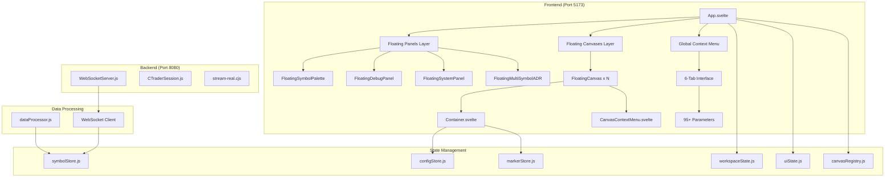

# NeuroSense FX - Interface Architecture & Functions Map

**Date**: 2025-10-18
**Status**: COMPLETE - Phase 2 Implementation
**Update**: Floating Panel Standardization Complete

## System Architecture Overview



## Interface Components Architecture

### 1. Application Root (App.svelte)
**Purpose**: Main application controller and event coordinator
**Key Functions**:
- `addFloatingCanvas()` - Creates new canvas instances
- `handleCanvasContextMenu()` - Manages right-click context menu
- `handleCanvasConfigChange()` - Updates canvas configuration
- `handleCanvasDragStart/Move/End()` - Manages canvas positioning
- `clearWorkspace()` - Resets workspace state

### 2. Floating Panels Layer

#### FloatingSymbolPalette (Position: 20, 20)
**Purpose**: Symbol selection and canvas creation interface
**Key Functions**:
- `handleSymbolSelect()` - Processes symbol selection
- `handleCreateCanvas()` - Creates new canvas for selected symbol
- `handleDragStart/Move/End()` - Panel positioning
- `handleMinimize()` - Panel state management
- `ensurePaletteInViewport()` - Boundary constraint

#### FloatingSystemPanel (Position: 350, 20)
**Purpose**: System controls and data source management
**Key Functions**:
- `handleDataSourceChange()` - Toggles between live/simulated data
- `handleMinimize()` - Panel state management
- `handleDragStart/Move/End()` - Panel positioning
- `ensureSystemInViewport()` - Boundary constraint

#### FloatingDebugPanel (Position: 680, 20)
**Purpose**: Debug information and performance metrics
**Key Functions**:
- `handleMinimize()` - Panel state management
- `handleDragStart/Move/End()` - Panel positioning
- `ensureDebugInViewport()` - Boundary constraint
- State display functions for market profile, price range, current state

#### FloatingMultiSymbolADR (Position: 20, 400)
**Purpose**: Multi-symbol ADR overview visualization
**Key Functions**:
- `handleMinimize()` - Panel state management
- `handleDragStart/Move/End()` - Panel positioning
- `ensureADRInViewport()` - Boundary constraint
- Canvas rendering of multi-symbol ADR data

### 3. Floating Canvases Layer

#### FloatingCanvas (N instances)
**Purpose**: Individual display containers with interactive controls
**Key Functions**:
- `handleRightClick()` - Triggers context menu
- `handleMouseDown()` - Initiates drag operations
- `handleMouseEnter/Leave()` - Hover state management
- `handleClose()` - Canvas removal
- `handleConfigChange()` - Configuration updates

#### Container (Visualization Core)
**Purpose**: Main visualization rendering engine
**Key Functions**:
- `draw()` - Main rendering orchestration
- `handleMouseMove()` - Hover state tracking
- `handleClick()` - Price marker management
- Reactive rendering block - Triggers redraws on data changes

#### CanvasContextMenu (6-Tab Interface)
**Purpose**: Comprehensive parameter control interface
**Key Functions**:
- `handleParameterChange()` - Updates visualization parameters
- `handleSearch()` - Parameter search functionality
- `handleShortcutAction()` - Keyboard navigation
- `switchTab()` - Tab navigation
- `adjustPositionForViewport()` - Boundary constraint

**Tab Structure**:
1. **QuickActionsTab** (12 parameters) - Essential toggles and show/hide controls
2. **PriceDisplayTab** (21 parameters) - Price float and display settings
3. **MarketProfileTab** (20 parameters) - Market profile visualization settings
4. **VolatilityTab** (16 parameters) - Volatility orb and flash settings
5. **LayoutSizingTab** (12 parameters) - Dimensions and positioning
6. **AdvancedTab** (17 parameters) - Power user and experimental features

## State Management Architecture

### 1. workspaceState.js
**Purpose**: Global workspace management and canvas tracking
**Key Functions**:
- `addCanvas()` - Adds new canvas to workspace
- `removeCanvas()` - Removes canvas from workspace
- `updateCanvas()` - Updates canvas properties
- `startDrag()` - Initiates drag operations
- `updateDragPosition()` - Updates position during drag
- `endDrag()` - Completes drag operations
- `toggleGrid()` - Grid display control
- `clearWorkspace()` - Resets workspace

### 2. uiState.js
**Purpose**: UI interaction state and panel visibility
**Key Functions**:
- `setActiveCanvas()` - Sets focused canvas
- `setHoveredCanvas()` - Sets hovered canvas
- `showContextMenu()` - Displays context menu
- `hideContextMenu()` - Hides context menu
- Panel visibility functions for all floating panels
- `hideAllMenus()` - Closes all menus

### 3. canvasRegistry.js
**Purpose**: Canvas metadata and lifecycle management
**Key Functions**:
- `registerCanvas()` - Registers new canvas
- `unregisterCanvas()` - Unregisters canvas
- `markCanvasActive()` - Marks canvas as active
- `bringCanvasToFront()` - Z-index management
- `changeCanvasSymbol()` - Updates canvas symbol
- `getCanvasZIndex()` - Retrieves Z-index

### 4. configStore.js
**Purpose**: Single source of truth for visualization parameters
**Key Functions**:
- `defaultConfig` - 95+ default visualization parameters
- `vizConfig` - Writable store for configuration
- Parameter validation with Zod schemas

### 5. symbolStore.js
**Purpose**: Symbol data management and worker coordination
**Key Functions**:
- `createNewSymbol()` - Creates new symbol with worker
- `dispatchTick()` - Sends tick data to worker
- `updateConfig()` - Updates symbol configuration
- `resetConfig()` - Resets to default configuration
- `removeSymbol()` - Removes symbol and terminates worker

### 6. markerStore.js
**Purpose**: Price marker management
**Key Functions**:
- `add()` - Adds new price marker
- `remove()` - Removes price marker
- Store subscription management

## Data Flow Architecture

### 1. Real-time Data Flow
```
cTrader API → Backend Server → WebSocket → wsClient → symbolStore → dataProcessor → Container → Canvas
```

### 2. Configuration Flow
```
CanvasContextMenu → configStore → symbolStore → dataProcessor → Container → Canvas
```

### 3. User Interaction Flow
```
User Input → Event Handlers → State Updates → Reactive Rendering → Visual Updates
```

## Event Management Architecture

**Reference**: See [`memory-bank/event-handling-architecture.md`](memory-bank/event-handling-architecture.md) for complete documentation

### 1. WorkspaceEventManager - Centralized Event Delegation
**Purpose**: Single event listeners for workspace interactions with efficient delegation pattern
**Key Functions**:
- `handleRightClick()` - Context menu triggers with canvas identification
- `handleMouseDown()` - Drag initiation with target validation
- `handleMouseMove()` - Drag operations with position updates
- `handleMouseUp()` - Drag completion with cleanup
- `handleKeyDown()` - Global keyboard shortcuts
- `handleClickOutside()` - Menu closure detection

**Event Delegation Pattern**:
```javascript
// Single listener for all canvas interactions
this.workspace.addEventListener('contextmenu', this.handleRightClick.bind(this));
this.workspace.addEventListener('mousedown', this.handleMouseDown.bind(this));

// Document-level listeners for drag operations
document.addEventListener('mousemove', this.handleMouseMove.bind(this));
document.addEventListener('mouseup', this.handleMouseUp.bind(this));

// Keyboard shortcuts
document.addEventListener('keydown', this.handleKeyDown.bind(this));
```

### 2. InteractWrapper Component - Unified Drag Functionality
**Purpose**: Consistent drag behavior across all floating components using interact.js library

**Key Features**:
- Viewport boundary checking with automatic adjustment
- Position persistence via localStorage
- Touch and mouse event handling
- Minimize state management
- Proper cleanup on component destroy
- Standardized z-index management
- Enhanced boundary checking for minimized state
- Inertia support for smooth dragging
- Snap configuration support
- Resizable option (when enabled)

**Implementation Pattern**:
```javascript
<InteractWrapper
  position={position}
  defaultPosition={defaultPosition}
  positionKey="floating-panel-position"
  on:positionChange={handlePositionChange}
  isDraggable={true}
  isResizable={false}
  inertia={true}
  boundaryPadding={10}
>
  <div class="draggable-panel">
    <!-- Panel content -->
  </div>
</InteractWrapper>
```

**Core Implementation**:
```javascript
// Initialize interact.js
const initializeInteract = () => {
  interactInstance = interact(element);
  
  // Configure draggable
  interactInstance.draggable({
    inertia: inertia ? {
      resistance: 10,
      minSpeed: 200,
      endSpeed: 100
    } : false,
    
    modifiers: [
      // Snap modifier if snap configuration is provided
      ...(snap ? [
        interact.modifiers.snap({
          targets: snap.targets || [],
          relativePoints: snap.relativePoints || [{ x: 0, y: 0 }],
          offset: snap.offset || { x: 0, y: 0 }
        })
      ] : []),
      
      // Restrict modifier for bounds
      interact.modifiers.restrict({
        restriction: bounds || 'parent',
        elementRect: { left: 0, right: 0, top: 0, bottom: 0 },
        endOnly: false
      })
    ],
    
    autoScroll: autoScroll,
    
    // Event listeners
    onstart: (event) => {
      isDragging = true;
      dispatch('dragStart', { event, position });
    },
    
    onmove: (event) => {
      const boundedPosition = ensureInBounds({ x, y });
      savePosition(boundedPosition);
      dispatch('dragMove', { event, position: boundedPosition });
    },
    
    onend: (event) => {
      isDragging = false;
      dispatch('dragEnd', { event, position: finalPosition });
    }
  });
};
```

**Custom Drag Implementation (useDraggable)**:
```javascript
const draggable = useDraggable({
  title: 'Panel Title',
  positionKey: 'floating-panel-position',
  defaultPosition: { x: 20, y: 20 },
  onPositionChange: handlePositionChange,
  onMinimizeChange: handleMinimizeChange
});
```

### 3. Component Event Dispatching Patterns
**Purpose**: Inter-component communication with consistent patterns
**Pattern**: Dispatch → Handle → Update State → Reactive Render

**Canvas Events**:
```javascript
// FloatingCanvas.svelte
function handleRightClick(event) {
  event.preventDefault();
  registryActions.markCanvasActive(id);
  dispatch('contextMenu', {
    canvasId: id,
    position: { x: event.clientX, y: event.clientY }
  });
}
```

**Panel Events**:
```javascript
// FloatingPanel.svelte
function handleMinimize() {
  isMinimized = !isMinimized;
  dispatch('minimizeChange', { isMinimized });
  localStorage.setItem(`${positionKey}-minimized`, isMinimized);
}
```

### 4. Event Flow Architecture

#### Canvas Interaction Flow
```
User right-clicks canvas
↓
WorkspaceEventManager.handleRightClick()
↓
Identify canvas via closest('.floating-canvas')
↓
registryActions.markCanvasActive(canvasId)
↓
uiActions.showContextMenu(position, canvasId)
↓
CanvasContextMenu component rendered
```

#### Canvas Drag Operations Flow
```
User mousedown on canvas
↓
FloatingCanvas.handleMouseDown()
↓
dispatch('dragStart', { canvasId, offset })
↓
App.svelte.handleCanvasDragStart()
↓
workspaceActions.startDrag(canvasId, offset)
↓
WorkspaceEventManager handles mousemove/mouseup
↓
workspaceActions.updateDragPosition()
↓
workspaceActions.endDrag()
```

#### Floating Panel Events Flow
```
User mousedown on panel drag handle
↓
useDraggable.handleDragStart()
↓
Global mousemove/mouseup listeners added
↓
Position updated with boundary checking
↓
Position saved to localStorage
↓
Cleanup on mouseup
```

### 5. Keyboard Shortcuts System

#### Global Shortcuts (WorkspaceEventManager)
```javascript
handleKeyDown(event) {
  if (event.target.tagName === 'INPUT' || event.target.tagName === 'TEXTAREA') return;
  
  switch (event.key) {
    case 'Escape':
      uiActions.hideAllMenus();
      break;
    case 'Delete':
    case 'Backspace':
      const activeCanvasId = this.getActiveSheet();
      if (activeCanvasId) {
        this.deleteCanvas(activeCanvasId);
      }
      break;
  }
}
```

#### Context-Specific Shortcuts (CanvasContextMenu)
```javascript
const shortcuts = {
  'Ctrl+F': () => searchInput.focus(),
  'Ctrl+Tab': () => switchTab((activeTab + 1) % tabs.length),
  'Escape': () => searchQuery ? clearSearch() : handleClose()
};
```

### 6. Performance Optimization Techniques

#### Event Delegation Benefits
- Single event listener for multiple elements
- Reduced memory footprint
- Consistent event handling
- Better performance with many elements

#### Reactive Updates
- Svelte's reactive statements for efficient rendering
- Store subscriptions for state changes
- No unnecessary redraws
- Immediate response to state changes

#### Proper Cleanup Patterns
```javascript
onDestroy(() => {
  // Cleanup shortcuts
  if (cleanupShortcuts) {
    cleanupShortcuts();
  }
  
  // Remove event listeners
  document.removeEventListener('click', handleClickOutside);
  window.removeEventListener('resize', handleResize);
});
```

## Data Processing Architecture

### 1. dataProcessor.js (Web Worker)
**Purpose**: Heavy computation off main thread
**Key Functions**:
- `initialize()` - Initializes worker with symbol data
- `processTick()` - Processes incoming tick data
- `updateConfig()` - Updates configuration
- `runCalculationsAndPostUpdate()` - Orchestrates calculations
- `updateVolatility()` - Calculates volatility metrics
- `generateMarketProfile()` - Creates market profile data
- `recalculateVisualRange()` - Calculates visual range
- `postStateUpdate()` - Sends updates to main thread

### 2. wsClient.js
**Purpose**: WebSocket communication and data source management
**Key Functions**:
- `connect()` - Establishes WebSocket connection
- `disconnect()` - Closes WebSocket connection
- `handleSocketMessage()` - Processes incoming messages
- `subscribe()` - Subscribes to symbol data
- `unsubscribe()` - Unsubscribes from symbol data
- `startSimulation()` - Starts simulated data generation
- `stopSimulation()` - Stops simulated data generation

## Visualization Rendering Architecture

### 1. Drawing Order (Container.svelte)
```
1. Background Fill
2. Market Profile
3. Day Range Meter
4. Volatility Orb
5. Price Float
6. Price Display
7. Volatility Metric
8. Price Markers
9. Hover Indicator
10. Flash Overlay
```

### 2. Reactive Rendering Pattern
```javascript
$: if (ctx && state && config && $hoverState !== undefined && $markerStore !== undefined) {
  markers = $markerStore;
  draw(state, config, markers);
}
```

## Performance Optimization Architecture

### 1. Render-on-Update Pattern
- Renders only when data, config, or interaction state changes
- No continuous animation frame loop
- Immediate response to state changes

### 2. Web Worker Architecture
- Heavy computation off main thread
- Message passing for data updates
- Efficient data processing pipelines

### 3. Memory Management
- Proper cleanup of store subscriptions
- Worker termination on symbol removal
- Efficient data structures for 20+ displays

## User Interaction Workflows

### 1. Canvas Creation Workflow
```
1. User opens FloatingSymbolPalette
2. User selects symbol from FXSymbolSelector
3. User clicks "Create Canvas"
4. FloatingSymbolPalette calls handleCreateCanvas()
5. App.svelte creates canvas data
6. Canvas registered in canvasRegistry
7. Canvas added to workspaceState
8. FloatingCanvas component rendered
9. Container component initializes visualization
```

### 2. Canvas Configuration Workflow
```
1. User right-clicks on canvas
2. FloatingCanvas triggers handleRightClick()
3. App.svelte shows CanvasContextMenu
4. User navigates 6 tabs
5. User adjusts 95+ parameters
6. CanvasContextMenu updates configStore
7. symbolStore updates worker
8. Container reactive rendering updates
```

### 3. Workspace Management Workflow
```
1. User drags canvas
2. WorkspaceEventManager handles drag events
3. workspaceState updates canvas position
4. Canvas reactive rendering updates position
5. canvasRegistry updates z-index
```

## Testing Infrastructure Architecture

### 1. Baseline Test Suite (6 tests, 9.7s)
- Application Load Test
- Layout Elements Test
- Empty State Test
- Floating Panels Test
- Console Errors Test
- Enhanced Context Menu Test

### 2. Component-Specific Tests
- Individual component validation
- Integration testing
- Visual regression testing

## Service Management Architecture

### 1. Unified Service Interface (run.sh)
```bash
./run.sh start         # Start all services
./run.sh stop          # Stop all services
./run.sh status        # Check service health
./run.sh logs          # View service logs
./run.sh cleanup       # Clean up old processes
```

### 2. Two-Server Pattern
- Frontend Server (Vite, Port 5173)
- Backend WebSocket Server (Node.js, Port 8080)

## Recent Optimizations (2025-10-18)

### 1. Floating Panel Standardization (COMPLETE)
- All floating panels migrated to use InteractWrapper component
- Created standardized z-index hierarchy in `src/constants/zIndex.js`
- Created unified position persistence utilities in `src/utils/positionPersistence.js`
- Enhanced boundary checking for all floating elements
- Implemented consistent drag behavior across all panels

### 2. Z-Index Hierarchy Standardization
- BACKGROUND: 1 (Workspace container)
- FLOATING_BASE: 1000 (Base for floating panels layer)
- SYMBOL_PALETTE: 1001 (FloatingSymbolPalette)
- DEBUG_PANEL: 1002 (FloatingDebugPanel)
- SYSTEM_PANEL: 1003 (FloatingSystemPanel)
- ADR_PANEL: 1004 (FloatingMultiSymbolADR)
- FLOATING_CANVAS_BASE: 2000 (Base for floating canvases)
- DRAGGING: 9999 (Any element being dragged)
- CONTEXT_MENU: 10000 (CanvasContextMenu - always on top)

**Implementation**:
```javascript
// src/constants/zIndex.js
export const Z_INDEX_LEVELS = {
  BACKGROUND: 1,
  FLOATING_BASE: 1000,
  SYMBOL_PALETTE: 1001,
  DEBUG_PANEL: 1002,
  SYSTEM_PANEL: 1003,
  ADR_PANEL: 1004,
  FLOATING_CANVAS_BASE: 2000,
  DRAGGING: 9999,
  CONTEXT_MENU: 10000
};

export function getZIndex(elementType) {
  return Z_INDEX_LEVELS[elementType] || Z_INDEX_LEVELS.FLOATING_BASE;
}

export function getCanvasZIndex(canvasIndex = 0) {
  return Z_INDEX_LEVELS.FLOATING_CANVAS_BASE + canvasIndex;
}
```

### 3. Position Persistence Unification
- Created `PositionPersistence` class with methods for:
  - Saving and loading positions
  - Saving and loading minimized states
  - Clearing element data
  - Getting all saved positions
- All floating panels now use unified position persistence

**Implementation**:
```javascript
// src/utils/positionPersistence.js
export class PositionPersistence {
  static savePosition(elementId, position) {
    localStorage.setItem(`floating-${elementId}-position`, JSON.stringify(position));
  }
  
  static loadPosition(elementId, defaultPosition = { x: 100, y: 100 }) {
    const saved = localStorage.getItem(`floating-${elementId}-position`);
    if (saved) {
      try {
        return JSON.parse(saved);
      } catch (e) {
        return { ...defaultPosition };
      }
    }
    return { ...defaultPosition };
  }
  
  static saveState(elementId, state) {
    localStorage.setItem(`floating-${elementId}-state`, JSON.stringify(state));
  }
  
  static loadState(elementId, defaultState = {}) {
    const saved = localStorage.getItem(`floating-${elementId}-state`);
    if (saved) {
      try {
        return JSON.parse(saved);
      } catch (e) {
        return { ...defaultState };
      }
    }
    return { ...defaultState };
  }
}
```

### 4. Connection Management Architecture
- **ConnectionManager Class**: Centralized data flow management
  - Canvas subscription management (tracks which canvases are subscribed to which symbols)
  - Symbol data caching (caches symbol data to avoid duplicate requests)
  - Connection monitoring (monitors WebSocket status and handles reconnections)
  - Data source mode switching (handles switching between live and simulated data)

**Implementation**:
```javascript
// src/data/ConnectionManager.js
class ConnectionManager {
  constructor() {
    // Track which canvases are subscribed to which symbols
    this.canvasSubscriptions = new Map(); // canvasId -> symbol
    this.symbolCanvases = new Map(); // symbol -> Set of canvasIds
    
    // Cache for symbol data to avoid duplicate requests
    this.symbolDataCache = new Map(); // symbol -> symbol data
    
    // Track subscription requests to prevent duplicates
    this.pendingSubscriptions = new Set(); // symbols being requested
  }
  
  async subscribeCanvas(canvasId, symbol) {
    // Track the subscription
    this.canvasSubscriptions.set(canvasId, symbol);
    
    if (!this.symbolCanvases.has(symbol)) {
      this.symbolCanvases.set(symbol, new Set());
    }
    this.symbolCanvases.get(symbol).add(canvasId);
    
    // Get or fetch symbol data
    const symbolData = await this.getSymbolData(symbol);
    return symbolData;
  }
  
  async getSymbolData(symbol) {
    // Check cache first
    if (this.symbolDataCache.has(symbol)) {
      return this.symbolDataCache.get(symbol);
    }
    
    // Fetch new data based on data source mode
    if (get(dataSourceMode) === 'live') {
      // Subscribe to live data
      subscribe(symbol);
      return this.waitForSymbolData(symbol);
    } else {
      // For simulated mode, symbol should already be in symbolStore
      const symbolStoreValue = get(symbolStore);
      const data = symbolStoreValue[symbol];
      if (data) {
        this.symbolDataCache.set(symbol, data);
        return data;
      }
    }
  }
}
```

### 5. Symbol Selection Implementation
- **FXSymbolSelector Component**: Advanced symbol selection with fuzzy search
  - Fuzzy matching implementation for symbol search
  - Full keyboard support with arrow keys and shortcuts
  - Visual feedback with matching character highlighting and subscription status
  - Debounced search implementation for performance
  - Full ARIA support for screen readers

**Implementation**:
```javascript
// src/components/FXSymbolSelector.svelte
function handleInput(event) {
  searchQuery = event.target.value;
  
  // Clear previous debounce
  clearTimeout(debounceTimeout);
  
  // Set new debounce
  debounceTimeout = setTimeout(() => {
    if (searchQuery.trim() === '') {
      isOpen = false;
    } else {
      isOpen = true;
    }
  }, 100); // 100ms debounce
}

function handleKeyDown(event) {
  switch (event.key) {
    case 'ArrowDown':
      event.preventDefault();
      highlightedIndex = Math.min(highlightedIndex + 1, filteredSymbols.length - 1);
      // Auto-scroll the dropdown to keep highlighted item visible
      break;
      
    case 'Enter':
      event.preventDefault();
      if (highlightedIndex >= 0 && highlightedIndex < filteredSymbols.length) {
        handleSymbolSelect(filteredSymbols[highlightedIndex], true);
      }
      break;
      
    case 'Escape':
      event.preventDefault();
      isOpen = false;
      searchQuery = '';
      highlightedIndex = -1;
      break;
  }
}
```

## Remaining Optimization Recommendations

### 1. Code Cleanup (Priority: High)
- Remove debug logs or implement conditional logging
- Clean up console.log statements in production

### 2. Extract Common Functionality (Priority: Medium)
- Create composables for drag handling
- Unify position persistence patterns
- Extract viewport boundary checks

### 3. Improve Memory Management (Priority: Medium)
- Ensure proper store subscription cleanup
- Optimize Web Worker communication

### 4. Optimize Event Handling (Priority: Low)
- Consolidate global event listeners
- Implement debouncing for frequent events

## Conclusion

The NeuroSense FX floating canvas implementation demonstrates excellent architectural design with a clean, modern codebase. The comprehensive interface architecture provides a solid foundation for the professional trading interface, with efficient data flow, comprehensive user interaction handling, and optimized performance for 20+ simultaneous displays.

The recent floating panel standardization has further improved the architectural consistency and maintainability of the codebase, with all floating elements now using a unified InteractWrapper component, standardized z-index hierarchy, and consistent position persistence.

This architecture documentation serves as the definitive reference for understanding the complete interface structure and function mappings within the NeuroSense FX system.