# Detailed Implementation Plan
## NeuroSense FX Legacy Architecture Migration

**Project:** Complete Legacy Store Migration  
**Target Date:** October 20-21, 2025  
**Scope:** Eliminate dual architecture, unify under floatingStore  
**Testing:** In-browser validation by user  

---

## 🎯 EXECUTIVE SUMMARY

This plan details the complete migration from the current dual-architecture system to a unified `floatingStore`-based architecture. The migration will eliminate 5 legacy stores, consolidate 12 legacy components, and resolve performance and maintenance issues created by the incomplete migration.

### Current State Problems
- **Dual Architecture**: Two parallel state management systems
- **Performance Overhead**: Duplicate reactive systems and event handlers
- **Maintenance Complexity**: Confusing codebase with mixed patterns
- **Feature Parity Issues**: New features require dual implementation

### Target State Benefits
- **Unified Architecture**: Single source of truth in `floatingStore`
- **Performance Optimization**: Eliminated duplicate systems
- **Simplified Maintenance**: Consistent patterns throughout
- **Development Velocity**: Clear architecture for future features

---

## 📊 ARCHITECTURE OVERVIEW

### Current Architecture (Hybrid)


### Target Architecture (Unified)


---

## 🗂️ MIGRATION PHASES

### Phase 1: Store Consolidation (Foundation)
**Duration**: 4-6 hours  
**Risk**: Medium  
**Impact**: Backend changes, no UI impact initially

#### 1.1 Configuration Migration


**Tasks:**
1. **Enhance floatingStore structure**
   ```javascript
   // Add to floatingStore initial state
   config: { ...defaultConfig }, // Migrate from configStore
   uiState: {
     hoveredDisplay: null,
     keyboardShortcuts: { enabled: true, helpVisible: false }
   }
   ```

2. **Migrate configStore parameters**
   - Move all 85+ visualization parameters to `floatingStore.config`
   - Update derived stores for config access
   - Maintain backward compatibility during transition

3. **Update FloatingDisplay.svelte**
   - Replace `import { vizConfig } from '../stores/configStore.js'`
   - Use `$floatingStore.config` instead
   - Test display rendering with all visualization features

4. **Update CanvasContextMenu.svelte**
   - Replace configStore imports
   - Update parameter group utilities
   - Test context menu functionality

**Validation:**
- [ ] All visualization parameters accessible via floatingStore
- [ ] FloatingDisplay renders correctly with all features
- [ ] Context menu updates configuration properly
- [ ] No console errors related to config access

#### 1.2 UI State Migration


**Tasks:**
1. **Migrate UI state to floatingStore**
   ```javascript
   // Add to floatingStore
   uiState: {
     hoveredDisplay: null,
     contextMenuOpen: false,
     keyboardShortcuts: { enabled: true, helpVisible: false }
   }
   ```

2. **Update hover state management**
   - Move hover logic from uiState to floatingStore
   - Update hover state actions in floatingStore
   - Modify components using hover state

3. **Migrate keyboard shortcuts**
   - Move keyboard shortcut state to floatingStore
   - Update keyboard event handlers
   - Test shortcut functionality

**Validation:**
- [ ] Hover states work correctly on displays
- [ ] Keyboard shortcuts function properly
- [ ] Context menu state management works
- [ ] No UI state conflicts

#### 1.3 Workspace Integration


**Tasks:**
1. **Integrate workspace state into displays**
   - Move canvas management to floatingStore.displays
   - Migrate drag state to floatingStore.draggedItem
   - Update display lifecycle management

2. **Consolidate active canvas logic**
   - Replace workspaceState.activeCanvas with floatingStore.activeDisplayId
   - Update canvas activation/deactivation
   - Migrate z-index management

3. **Update drag and drop**
   - Centralize drag logic in floatingStore
   - Update drag event handlers
   - Test drag functionality

**Validation:**
- [ ] Display creation/deletion works
- [ ] Drag and drop functions correctly
- [ ] Z-index management works
- [ ] Active display tracking works

#### 1.4 Canvas Registry Integration


**Tasks:**
1. **Migrate metadata tracking**
   - Move canvas metadata to display objects
   - Update metadata access patterns
   - Remove registry dependency

2. **Consolidate z-index management**
   - Use floatingStore z-index counters
   - Update bring-to-front/send-to-back logic
   - Test layering behavior

3. **Migrate symbol tracking**
   - Move symbol-canvas mapping to floatingStore
   - Update symbol lookup functions
   - Test symbol management

**Validation:**
- [ ] Canvas metadata accessible via displays
- [ ] Z-index management works correctly
- [ ] Symbol tracking functions properly
- [ ] No registry-related errors

#### 1.5 Symbol State Integration


**Tasks:**
1. **Integrate vizState into displays**
   - Move symbol state into display objects
   - Update state access patterns
   - Remove symbolStateStore dependency

2. **Update market profile data flow**
   - Integrate market profile into display state
   - Update market profile rendering
   - Test profile visualization

3. **Migrate ADR calculations**
   - Move ADR logic to display level
   - Update ADR rendering
   - Test ADR functionality

**Validation:**
- [ ] Symbol state accessible via displays
- [ ] Market profile renders correctly
- [ ] ADR calculations work properly
- [ ] Real-time data updates function

---

### Phase 2: Component Migration (Frontend)
**Duration**: 3-4 hours  
**Risk**: High  
**Impact**: Visible UI changes

#### 2.1 Panel Component Standardization


**Tasks:**
1. **Remove FloatingSymbolPalette.svelte**
   - Delete legacy component
   - Ensure SymbolPalette.svelte handles all functionality
   - Test symbol selection and display creation

2. **Convert FloatingDebugPanel.svelte**
   - Create new DebugPanel.svelte using FloatingPanel.svelte
   - Migrate debug functionality to new architecture
   - Update debug data sources to use floatingStore

3. **Convert FloatingSystemPanel.svelte**
   - Create new SystemPanel.svelte using FloatingPanel.svelte
   - Migrate system controls to new architecture
   - Update system state management

4. **Update panel management**
   - Implement unified panel rendering in App.svelte
   - Add panel lifecycle management
   - Test panel interactions

**Validation:**
- [ ] Symbol palette functionality works
- [ ] Debug panel displays correct information
- [ ] System panel controls function properly
- [ ] Panel drag/resize works
- [ ] Panel z-index management works

#### 2.2 Display Component Cleanup


**Tasks:**
1. **Remove FloatingCanvas.svelte**
   - Verify all functionality in FloatingDisplay.svelte
   - Delete legacy component
   - Update any remaining references

2. **Enhance FloatingDisplay.svelte**
   - Ensure all drag/resize functionality works
   - Verify context menu integration
   - Test all display interactions

**Validation:**
- [ ] All display functionality works
- [ ] No references to FloatingCanvas.svelte
- [ ] Display performance is maintained

#### 2.3 App.svelte Unification


**Tasks:**
1. **Implement unified component rendering**
   ```svelte
   <!-- Unified panel rendering -->
   {#each $activePanels as panel (panel.id)}
     <FloatingPanel {panel} />
   {/each}
   
   <!-- Display rendering -->
   {#each $activeDisplays as display (display.id)}
     <FloatingDisplay {display} />
   {/each}
   ```

2. **Remove legacy component imports**
   - Delete imports for legacy components
   - Remove legacy component usage
   - Clean up unused variables

3. **Add global event handling**
   - Implement unified event delegation
   - Add keyboard shortcut handling
   - Test global interactions

**Validation:**
- [ ] All components render via unified loops
- [ ] No legacy component imports
- [ ] Global events work correctly
- [ ] App loads without errors

---

### Phase 3: Utility Migration (Support)
**Duration**: 2-3 hours  
**Risk**: Low  
**Impact**: Backend utilities

#### 3.1 Utility File Updates


**Tasks:**
1. **Update WorkspaceEventManager.js**
   - Replace workspaceState imports with floatingStore
   - Update event handling to use floatingStore actions
   - Test workspace event management

2. **Update parameter utilities**
   - Replace configStore imports with floatingStore
   - Update parameter access patterns
   - Test parameter validation

3. **Update symbolStore.js**
   - Remove legacy store dependencies
   - Clean up unused imports
   - Test symbol data flow

**Validation:**
- [ ] All utilities use floatingStore
- [ ] Parameter management works
- [ ] Symbol data flow functions
- [ ] No legacy store imports remain

---

### Phase 4: Cleanup & Validation (Final)
**Duration**: 1-2 hours  
**Risk**: Low  
**Impact**: Code cleanup

#### 4.1 Legacy File Removal

```mermaid
graph TB
    subgraph "File Cleanup"
        subgraph "Stores to Delete"
            CS[configStore.js]
            US[uiState.js]
            WS[workspaceState.js]
            SSS[symbolStateStore.js]
            CR[canvasRegistry.js]
        end
        
        subgraph "Components to Delete"
            FSP[FloatingSymbolPalette.svelte]
            FC[FloatingCanvas.svelte]
        end
        
        CS -->|delete| DEL[🗑️]
        US --> DEL
        WS --> DEL
        SSS --> DEL
        CR --> DEL
        FSP --> DEL
        FC --> DEL
    end
```


**Tasks:**
1. **Delete legacy stores**
   - Remove all 5 legacy store files
   - Verify no remaining imports
   - Test application functionality

2. **Delete legacy components**
   - Remove FloatingSymbolPalette.svelte
   - Remove FloatingCanvas.svelte
   - Clean up component directory

3. **Final code cleanup**
   - Remove unused imports
   - Clean up comments
   - Format code consistently

**Validation:**
- [ ] All legacy files deleted
- [ ] No import errors
- [ ] Application loads and functions
- [ ] Code is clean and consistent

---

## 🧪 TESTING STRATEGY

### In-Browser Testing Plan

#### Phase 1 Testing (Store Migration)
1. **Configuration Testing**
   - Open CanvasContextMenu
   - Verify all 85+ parameters are accessible
   - Test parameter changes affect displays
   - Check console for errors

2. **UI State Testing**
   - Hover over displays
   - Test keyboard shortcuts (Ctrl+N, Escape)
   - Verify context menu state
   - Check hover state transitions

3. **Workspace Testing**
   - Create multiple displays
   - Test drag and drop
   - Verify z-index management
   - Test display activation

4. **Registry Testing**
   - Check display metadata
   - Test layering behavior
   - Verify symbol tracking
   - Check canvas lifecycle

5. **Symbol State Testing**
   - Verify market profile rendering
   - Test ADR calculations
   - Check real-time data updates
   - Validate symbol state persistence

#### Phase 2 Testing (Component Migration)
1. **Panel Testing**
   - Test SymbolPalette symbol selection
   - Verify DebugPanel information accuracy
   - Test SystemPanel controls
   - Check panel drag/resize

2. **Display Testing**
   - Create displays via SymbolPalette
   - Test all display interactions
   - Verify context menu functionality
   - Check display performance

3. **App Integration Testing**
   - Verify all components render
   - Test global event handling
   - Check component lifecycle
   - Validate state synchronization

#### Phase 3 Testing (Utility Migration)
1. **Utility Testing**
   - Test workspace event management
   - Verify parameter validation
   - Check symbol data flow
   - Test utility functions

#### Phase 4 Testing (Final Validation)
1. **Performance Testing**
   - Create 20+ displays
   - Monitor performance (60fps target)
   - Check memory usage (<500MB)
   - Verify CPU usage (<50%)

2. **Functionality Testing**
   - Test complete user workflows
   - Verify all features work
   - Check error handling
   - Validate data consistency

### Testing Checklist

#### Core Functionality
- [ ] Symbol selection and display creation
- [ ] Display drag and drop
- [ ] Context menu operations
- [ ] Configuration changes
- [ ] Real-time data updates
- [ ] Keyboard shortcuts
- [ ] Panel management
- [ ] Z-index layering

#### Performance
- [ ] 20+ displays render at 60fps
- [ ] Memory usage under 500MB
- [ ] CPU usage under 50%
- [ ] No memory leaks
- [ ] Smooth animations

#### Error Handling
- [ ] Graceful WebSocket disconnection
- [ ] Invalid symbol handling
- [ ] Configuration validation
- [ ] Component error boundaries
- [ ] Console error-free

#### User Experience
- [ ] Intuitive drag and drop
- [ ] Responsive context menus
- [ ] Smooth transitions
- [ ] Consistent behavior
- [ ] Clear visual feedback

---

## 📈 IMPLEMENTATION TIMELINE

### Day 1: Foundation (Phase 1)
- **Morning (4 hours)**: Store Consolidation
  - Hours 1-2: Configuration migration
  - Hours 3-4: UI state and workspace integration
- **Afternoon (4 hours)**: Registry and Symbol State
  - Hours 5-6: Canvas registry integration
  - Hours 7-8: Symbol state integration
- **Evening**: Testing and validation

### Day 2: Frontend (Phase 2-3)
- **Morning (3 hours)**: Component Migration
  - Hours 1-2: Panel standardization
  - Hour 3: Display cleanup and App.svelte unification
- **Afternoon (2 hours)**: Utility Migration
  - Hours 4-5: Utility file updates
- **Evening**: Testing and cleanup

### Day 3: Finalization (Phase 4)
- **Morning (2 hours)**: Cleanup and final testing
- **Afternoon**: Performance validation and documentation

---

## 🚨 RISK MITIGATION

### High-Risk Areas
1. **Data Flow Interruption**
   - **Risk**: Breaking real-time data updates
   - **Mitigation**: Incremental migration with testing at each step
   - **Rollback**: Git tags at each major step

2. **Performance Regression**
   - **Risk**: Slower performance after migration
   - **Mitigation**: Performance testing after each phase
   - **Rollback**: Revert to last working state

3. **Feature Loss**
   - **Risk**: Missing functionality after migration
   - **Mitigation**: Comprehensive feature checklist
   - **Rollback**: Feature-by-feature validation

### Rollback Strategy
1. **Git Tags**: Create tag before each major migration step
2. **Incremental Testing**: Test after each store migration
3. **Feature Validation**: Verify all features work before proceeding
4. **Performance Monitoring**: Check performance after each phase

---

## 📋 SUCCESS CRITERIA

### Technical Success
- [ ] All legacy stores removed
- [ ] All components use floatingStore
- [ ] No console errors
- [ ] Performance targets met
- [ ] All features functional

### User Experience Success
- [ ] Intuitive interface
- [ ] Smooth interactions
- [ ] Responsive performance
- [ ] Consistent behavior
- [ ] No functionality loss

### Maintenance Success
- [ ] Clean codebase
- [ ] Consistent patterns
- [ ] Clear architecture
- [ ] Comprehensive documentation
- [ ] Easy future development

---

## 🎯 NEXT STEPS

1. **Review this plan** with user approval
2. **Create Git branch** for migration work
3. **Set up development environment** with backup
4. **Begin Phase 1** store consolidation
5. **Test thoroughly** after each step
6. **Document progress** and issues
7. **Complete migration** and validate success

This plan provides a comprehensive roadmap for eliminating the dual architecture and unifying NeuroSense FX under the floatingStore system. The incremental approach minimizes risk while ensuring complete migration of all functionality.

---

**Migration Team:** Cline (AI Software Engineer)  
**Document Created:** October 19, 2025  
**Status:** Ready for Implementation  
**Next Phase:** Step 4 - Cleanup & Validation
