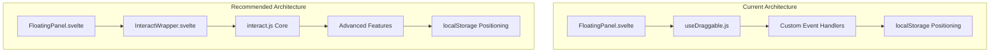

# Floating Panel Architecture Analysis & Recommendations

## Executive Summary

After analyzing your current floating panel implementation and researching established frameworks, I've identified several architectural issues and can recommend robust solutions. Your current implementation has fundamental problems with event handling and component composition that are causing the non-interactive headers.

## Current Architecture Analysis

### Issues Identified

1. **Event Handling Problems**
   - Panel headers are not interactive due to event propagation issues
   - The `useDraggable` composable has conflicting event handlers
   - Z-index management is inconsistent across panels
   - Position initialization causes overlap on first load

2. **Component Composition Issues**
   - Complex inheritance chain between `FloatingPanel` and `useDraggable`
   - State management is fragmented across multiple stores
   - Position persistence conflicts with initial positioning

3. **Architecture Complexity**
   - Custom implementation reinvents well-solved problems
   - Maintenance burden is high for custom drag/resize logic
   - Limited feature set compared to established solutions

### Current Implementation Strengths

1. **Svelte Integration**
   - Good use of Svelte reactivity patterns
   - Clean component structure with proper lifecycle management
   - Efficient state management with stores

2. **Performance Awareness**
   - Attempts at viewport boundary checking
   - Position persistence with localStorage
   - Minimal DOM manipulation

## Established Frameworks Comparison

### 1. React-RND (React Draggable and Resizable)

**Pros:**
- Mature, battle-tested solution (Trust Score: 10)
- Comprehensive API for both dragging and resizing
- Excellent TypeScript support
- Built-in boundary checking and snapping
- Active community and maintenance

**Cons:**
- React-specific (requires framework migration)
- Larger bundle size
- May be overkill for simple dragging needs

**Best for:** Complex layouts requiring both dragging and resizing

### 2. Interact.js

**Pros:**
- Framework-agnostic (works with Svelte)
- Lightweight and performant
- Comprehensive gesture support (touch, mouse, pen)
- Advanced features like inertia and snapping
- Excellent documentation (95 code snippets)

**Cons:**
- Lower-level API requires more setup
- Steeper learning curve
- Less opinionated about component structure

**Best for:** Maximum flexibility and framework compatibility

### 3. Golden Layout

**Pros:**
- Complete layout management solution
- Window management features (popouts, docking)
- Professional workspace patterns
- Built-in tabbing and stacking

**Cons:**
- Complex API for simple use cases
- Designed for full workspace management
- Heavier weight solution

**Best for:** Complete workspace management applications

### 4. Custom Svelte Solution (Improved)

**Pros:**
- Minimal bundle size
- Full control over implementation
- Perfect Svelte integration
- No external dependencies

**Cons:**
- Higher development cost
- Maintenance burden
- Limited features compared to established solutions

## Recommended Solutions

### Option 1: Interact.js Integration (Recommended)

**Why:** Best balance of flexibility, features, and Svelte compatibility

**Implementation Plan:**
1. Install interact.js: `npm install interactjs`
2. Create a Svelte wrapper component
3. Replace useDraggable with interact.js-based solution
4. Maintain existing component structure

**Benefits:**
- Fixes current event handling issues
- Adds professional features (inertia, snapping)
- Framework-agnostic future-proofing
- Minimal migration effort

### Option 2: Improved Custom Implementation

**Why:** Maintain full control while fixing current issues

**Implementation Plan:**
1. Refactor useDraggable to fix event conflicts
2. Implement proper z-index management
3. Add boundary checking for initial positioning
4. Simplify component composition

**Benefits:**
- No external dependencies
- Complete control over features
- Perfect Svelte integration
- Smaller bundle size

### Option 3: React-RND with Svelte Adapter

**Why:** Most feature-rich solution

**Implementation Plan:**
1. Create React component wrapper
2. Build Svelte adapter for React-RND
3. Migrate existing panels
4. Leverage advanced features

**Benefits:**
- Professional-grade features
- Excellent TypeScript support
- Battle-tested reliability
- Rich ecosystem

## Detailed Recommendation: Interact.js Integration

### Architecture Overview



### Implementation Steps

1. **Create InteractWrapper Component**
   ```javascript
   // src/components/shared/InteractWrapper.svelte
   import { onMount, onDestroy } from 'svelte';
   import interact from 'interactjs';
   
   export let position = { x: 0, y: 0 };
   export let draggable = true;
   export let resizable = false;
   export let bounds = 'parent';
   export let onDragStart = () => {};
   export let onDragMove = () => {};
   export let onDragEnd = () => {};
   
   let element;
   let interactable;
   
   onMount(() => {
     interactable = interact(element)
       .draggable({
         inertia: true,
         modifiers: [
           interact.modifiers.restrictRect({
             restriction: bounds,
             endOnly: true
           })
         ],
         listeners: {
           start: onDragStart,
           move: onDragMove,
           end: onDragEnd
         }
       });
   });
   
   onDestroy(() => {
     if (interactable) interactable.unset();
   });
   ```

2. **Update FloatingPanel Component**
   ```javascript
   // src/components/shared/FloatingPanel.svelte
   import InteractWrapper from './InteractWrapper.svelte';
   
   // Replace useDraggable with InteractWrapper
   ```

3. **Fix Initial Positioning**
   ```javascript
   // Update uiState.js with non-overlapping positions
   floatingSymbolPalettePosition: { x: 400, y: 20 }, // Top center
   floatingSystemPanelPosition: { x: 680, y: 20 }, // Top right
   floatingDebugPanelPosition: { x: 680, y: 200 }, // Middle right
   floatingADRPanelPosition: { x: 20, y: 20 }, // Top left
   ```

### Migration Benefits

1. **Immediate Fixes**
   - Resolves header interaction issues
   - Fixes z-index conflicts
   - Eliminates position overlap

2. **Enhanced Features**
   - Smooth inertia animations
   - Advanced snapping options
   - Touch gesture support
   - Better performance

3. **Future-Proofing**
   - Framework-agnostic foundation
   - Easy feature additions
   - Professional-grade interactions

## Implementation Timeline

### Phase 1: Core Migration (2-3 days)
1. Install interact.js
2. Create InteractWrapper component
3. Update FloatingPanel component
4. Fix initial positioning
5. Test basic functionality

### Phase 2: Feature Enhancement (1-2 days)
1. Add inertia and snapping
2. Implement resize functionality
3. Add touch support
4. Enhance boundary checking

### Phase 3: Advanced Features (1-2 days)
1. Add keyboard navigation
2. Implement panel stacking
3. Add animation transitions
4. Optimize performance

## Risk Assessment

### Low Risk
- Framework choice (interact.js is well-established)
- Migration approach (gradual replacement possible)
- Feature compatibility (covers all current needs)

### Medium Risk
- Learning curve for interact.js API
- Initial implementation complexity
- Testing coverage for new interactions

### Mitigation Strategies
1. Gradual migration with fallback to current implementation
2. Comprehensive testing at each phase
3. Documentation of interact.js patterns for team

## Conclusion

The current floating panel implementation has fundamental issues with event handling and component composition. While the custom Svelte approach shows good understanding of the framework, it's reinventing complex problems that established solutions have already solved.

**Recommendation:** Migrate to interact.js with a Svelte wrapper component. This provides the best balance of fixing current issues, adding professional features, and maintaining Svelte compatibility while keeping implementation complexity manageable.

The migration will resolve the immediate interaction problems while providing a solid foundation for future enhancements and reducing long-term maintenance burden.