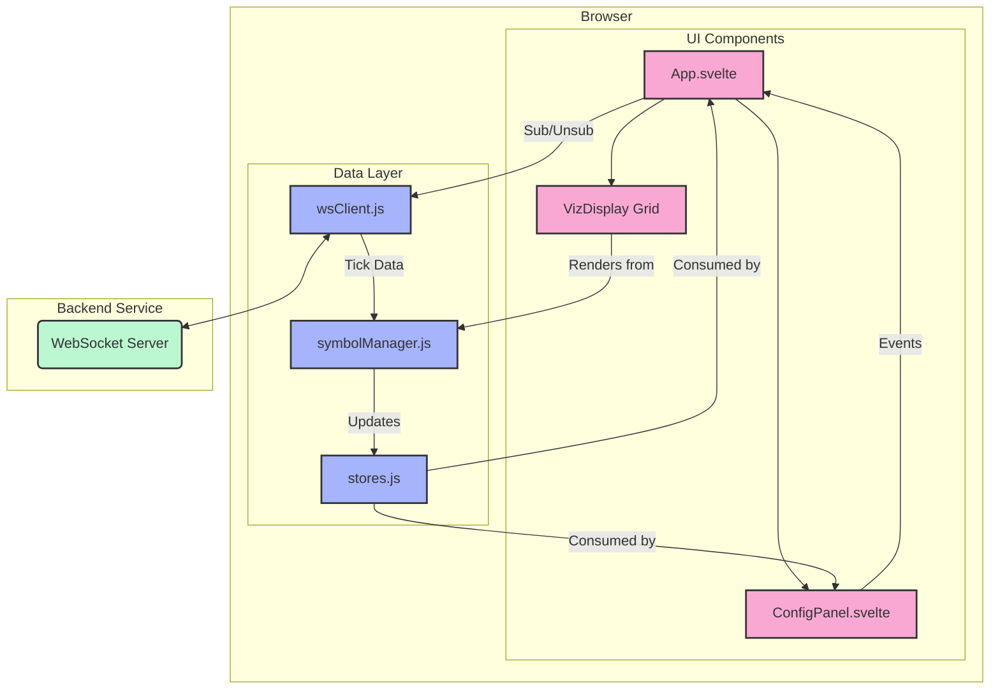

# Frontend Architecture for NeuroSense FX

## 1. Overview
This document outlines the architecture of the NeuroSense FX Svelte frontend. The primary goal is to create a highly performant, multi-instance visualization dashboard capable of displaying 20+ real-time data feeds simultaneously. The architecture prioritizes a lean footprint, main-thread efficiency, and maintainability.

## 2. Core Principles

*   **Reactivity**: Leverages Svelte's native reactivity to ensure the UI updates efficiently whenever data changes, without a virtual DOM.
*   **Component-Based**: The UI is broken down into small, reusable components (`App`, `ConfigPanel`, `VizDisplay`) with clear responsibilities.
*   **Centralized State Management**: Svelte stores are used to manage shared state (like connection status and symbol data) in a clean, decoupled manner.
*   **Performance**: The core visualization is rendered on an HTML Canvas to minimize DOM manipulation overhead, which is critical for scaling to many instances. Data processing is centralized to avoid redundant computations.

## 3. High-Level Architecture

The frontend is structured around a central data layer that receives information from the backend WebSocket and makes it available to the UI components via reactive Svelte stores.

## 4. Component & Module Breakdown

### UI Components (`src/components/`)

*   **`App.svelte`**: The main application component.
    *   **Responsibilities**:
        *   Acts as a "grid manager" for the visualizations.
        *   Subscribes to the `symbolStates` store to get data for all active symbols.
        *   Uses a Svelte `{#each}` block to dynamically render a `VizDisplay` component for each subscribed symbol.
        *   Handles events from `ConfigPanel` to trigger subscriptions/unsubscriptions.
        *   Displays the WebSocket connection status.

*   **`ConfigPanel.svelte`**: The user interface for controlling the application.
    *   **Responsibilities**:
        *   Allows users to switch between "Live" and "Simulated" data sources.
        *   Populates a symbol input list from the `availableSymbols` store (provided by the backend).
        *   Allows users to add and remove symbol subscriptions.
        *   Provides controls for global visualization parameters (e.g., ADR range).

*   **`VizDisplay.svelte`**: The core visualization component.
    *   **Responsibilities**:
        *   Renders a single symbol's real-time data on an HTML Canvas.
        *   Receives its `config` and `state` (for one symbol) as props from `App.svelte`.
        *   Contains all D3.js and Canvas API logic for drawing the price float, ADR meter, etc.
        *   Reactively re-renders whenever its `state` prop changes.

### Data Layer (`src/data/`)

*   **`wsClient.js`**: Manages all WebSocket communication.
    *   **Responsibilities**:
        *   Establishes and maintains the WebSocket connection to the backend, using the Vite proxy for robust communication in the dev environment.
        *   Handles incoming messages (`connection`, `tick`, `subscribeResponse`, etc.).
        *   Populates the `tickData`, `wsStatus`, and `availableSymbols` Svelte stores.
        *   Exposes `subscribe()` and `unsubscribe()` functions for UI components to call.
        *   Includes a "Simulated" data mode for testing.

*   **`symbolManager.js`**: The central state management hub for all symbol data.
    *   **Responsibilities**:
        *   Subscribes to the `tickData` store from `wsClient.js`.
        *   Processes incoming ticks to calculate derived state (e.g., volatility, ADR boundaries).
        *   Maintains the `symbolStates` store, which is an object where keys are symbol names and values are their complete state objects.
        *   Creates and deletes state objects for symbols as they are subscribed or unsubscribed.

*   **`stores.js`**: Defines global, non-symbol-specific Svelte stores.
    *   **Responsibilities**:
        *   `vizConfig`: Holds the global configuration object for all visualizations.
        *   `vizState`: Holds the initial structure for a single symbol's state (this is now largely superseded by `symbolManager.js` but can be used for defining the data shape).

---
