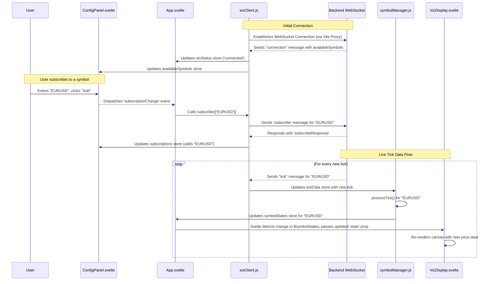

# Frontend Data Flow for NeuroSense FX

## 1. Overview
This document details the flow of data through the NeuroSense FX frontend, from the initial WebSocket connection to the final pixel rendered on the canvas. Understanding this flow is crucial for debugging and extending the application.

The data flow is designed to be unidirectional and reactive, leveraging Svelte stores to ensure that the UI updates automatically in response to new data.

## 2. Data Flow Diagram

## 3. Detailed Step-by-Step Flow

### Step 1: Application Initialization

1.  **`App.svelte` Mounts**: The main application component is rendered.
2.  **`wsClient.js` Initializes**: The WebSocket client attempts to connect to the backend via the Vite proxy (`/ws`). The `wsStatus` store is set to `"connecting"`. `App.svelte` displays this status.
3.  **Connection Established**:
    *   The backend accepts the connection and sends a `{"type": "connection", "availableSymbols": [...]}` message.
    *   `wsClient.js`'s `onmessage` handler receives this message.
    *   It updates the `wsStatus` store to `"connected"`.
    *   It populates the `availableSymbols` store with the array of symbols from the backend.
    *   `ConfigPanel.svelte`, which subscribes to `availableSymbols`, now shows the full list in its datalist input.

### Step 2: User Subscribes to a Symbol

1.  **User Interaction**: The user selects `"Live"` data mode, types "EURUSD" into the input in `ConfigPanel.svelte`, and clicks "Add".
2.  **Event Dispatch**: `ConfigPanel.svelte` dispatches a custom `subscriptionChange` event with the details `{ symbols: ['EURUSD'], subscribe: true }`.
3.  **Event Handling**: `App.svelte` listens for this event and calls the `subscribe(['EURUSD'])` function exported from `wsClient.js`.
4.  **WebSocket Message**: `wsClient.js` sends a JSON message to the backend: `{"type": "subscribe", "symbols": ["EURUSD"]}`.
5.  **Backend Response**: The backend processes the request and sends back a `{"type": "subscribeResponse", ...}`.
6.  **Store Update**: `wsClient.js` receives this response and updates the `subscriptions` Svelte store, adding "EURUSD" to the `Set`. `ConfigPanel.svelte` reactively updates to show "EURUSD" in the list of active subscriptions.

### Step 3: Real-time Tick Data Processing

1.  **Tick Received**: The backend sends a `{"type": "tick", "symbol": "EURUSD", "bid": 1.12345, ...}` message.
2.  **`wsClient.js` Updates `tickData`**:
    *   The `onmessage` handler in `wsClient.js` receives the tick.
    *   It calls `tickData.update()`, adding or updating the "EURUSD" entry in the `tickData` store. This store now looks like `{ "EURUSD": { ...tick data... } }`.
3.  **`symbolManager.js` Processes the Tick**:
    *   `symbolManager.js` is subscribed to the `tickData` store. Its subscription callback fires.
    *   It calls its internal `processTick("EURUSD", tick)` function.
    *   Inside `processTick`, it updates the master `symbolStates` store. It finds the state object for "EURUSD" (or creates it if it's the first tick for that symbol).
    *   It updates `currentPrice`, `lastTickDirection`, calculates new `volatility` and `adrHigh`/`adrLow`, etc., within that specific symbol's state object.
4.  **Svelte Reactivity Cascade**:
    *   The `symbolStates.update()` call triggers Svelte's reactivity system.
    *   `App.svelte` is subscribed to `$symbolStates`. The `{#each Object.entries($symbolStates) ...}` block is re-evaluated.
    *   The `VizDisplay` component responsible for "EURUSD" receives a new `state` prop containing the updated data.
5.  **Canvas Re-rendering**:
    *   Inside `VizDisplay.svelte`, the `$: if (ctx && state...)` reactive block is triggered by the prop change.
    *   The `drawVisualization()` function is called, which clears the canvas and re-draws all visual elements (ADR meter, price float, etc.) using the new values from the `state` prop.

This entire flow, from `tickData.update()` to the final pixel being drawn, happens automatically and efficiently due to Svelte's reactive nature.

### Step 4: Unsubscribing

The process for unsubscribing is similar but in reverse:
1.  User clicks the "x" button next to a symbol in `ConfigPanel.svelte`.
2.  An `unsubscribe` event is dispatched to `App.svelte`.
3.  `App.svelte` calls `unsubscribe(['EURUSD'])` in `wsClient.js`.
4.  `wsClient.js` sends the `{"type": "unsubscribe", ...}` message.
5.  On receiving the `unsubscribeResponse`, `wsClient.js` removes the symbol from the `subscriptions` store.
6.  **Crucially**, `symbolManager.js` also needs logic to *remove* the symbol's state from the `symbolStates` store when an unsubscribe happens. This will cause the `{#each}` block in `App.svelte` to remove the corresponding `VizDisplay` component from the DOM. *(Note: This is an area for future improvement in the `symbolManager`)*.

---
