# Scope: TradingView Parallel Data Feed

## Overview

Add TradingView as a second, independent market data source for the **Day Range Meter**. Traders choose their data source when creating a display via keyboard shortcuts (Alt+A for cTrader, Alt+T for TradingView). Two parallel, non-interacting feeds keep the architecture simple and elegant.

**Core Focus:** Day Range Meter visualization using D1 (daily) candles from TradingView.

---

## Current Architecture


---

## Target Architecture


**Key Principle: Parallel, non-interacting feeds**
- cTrader feed continues working as-is
- TradingView feed is completely separate
- NO divergence detection, NO source switching, NO averaging, NO comparison logic

---

## Day Range Meter Data Requirements

The Day Range Meter requires specific data fields for proper visualization:

```mermaid
flowchart LR
    subgraph REQUIRED["Day Range Meter Requirements"]
        R1[current]
        R2[open]
        R3[high]
        R4[low]
        R5[adrHigh]
        R6[adrLow]
    end

    subgraph CTRADER["cTrader Provides"]
        C1[current✓]
        C2[open✓]
        C3[high✓]
        C4[low✓]
        C5[adrHigh✓]
        C6[adrLow✓]
    end

    subgraph TV["TradingView D1 Candle"]
        T1[close→current✓]
        T2[open✓]
        T3[high✓]
        T4[low✓]
        T5[adrHigh?]
        T6[adrLow?]
    end

    style REQUIRED fill:#1a3a5f
    style CTRADER fill:#1a5f3a
    style TV fill:#5f3a1a
```



### Critical Finding: ADR Calculation Required

TradingView D1 candles provide OHLC but **NOT** `adrHigh` and `adrLow`. These must be calculated from historical daily candles on the backend.

**ADR (Average Daily Range) Formula:**
```javascript
// From historical D1 candles (excluding today's incomplete candle)
const adr = average(high - low) for last 14 complete days
const adrHigh = today's open + (adr / 2)
const adrLow = today's open - (adr / 2)
```

---

## User Interface

### Keyboard Shortcuts


### Visual Source Indicator

Each Day Range Meter display shows a source badge:
- **cTrader** - Green badge (existing behavior)
- **TradingView** - Orange badge (new)

```mermaid
flowchart LR
    D[Day Range Meter] --> B[Source Badge]
    B --> |cTrader| G["🟢 cTrader"]
    B --> |TradingView| O["🟠 TradingView"]

    style G fill:#1a5f3a
    style O fill:#5f3a1a
```



---

## Data Flow: D1 Candle to Day Range Meter


---

## Component Changes

### 1. Backend: New Components


### 2. Backend: ADR Calculation (Critical Addition)


**Implementation (~20 lines):**
```javascript
async getHistoricalAde(symbol, lookbackDays = 14) {
  const candles = await this.tvClient.getCandles({
    symbol: symbol,
    period: 'D',
    amount: lookbackDays + 5
  });

  // Exclude partial candles (first and last)
  const completeCandles = candles.slice(1, -1);
  const ranges = completeCandles.map(c => c.high - c.low);
  const adr = ranges.reduce((a, b) => a + b, 0) / ranges.length;

  const lastCandle = candles[candles.length - 1];
  return {
    adrHigh: lastCandle.open + (adr / 2),
    adrLow: lastCandle.open - (adr / 2),
    open: lastCandle.open,
    high: lastCandle.high,
    low: lastCandle.low,
    current: lastCandle.close
  };
}
```

### 3. Client: Modified Components


---

## Data Structure Mapping

### TradingView Library Output

```typescript
// tradingview-ws returns D1 candles:
interface Candle {
    time: number      // Unix timestamp
    open: number
    high: number
    low: number
    close: number
    volume: number
}
```

### Our Message Format (Day Range Meter)

```typescript
// TradingView backend emits (with ADR calculated):
interface TradingViewDataPackage {
    type: 'symbolDataPackage'
    source: 'tradingview'
    symbol: string
    open: number
    high: number
    low: number
    current: number      // close price
    adrHigh: number      // CALCULATED from historical
    adrLow: number       // CALCULATED from historical
}

// Real-time updates:
interface TradingViewTick {
    type: 'tick'
    source: 'tradingview'
    symbol: string
    price: number        // close (current price)
    timestamp: number
}

// cTrader backend emits (unchanged):
interface CTraderTick {
    type: 'tick'
    source: 'ctrader'
    symbol: string
    bid: number
    ask: number
    timestamp: number
    pipPosition: number
    pipSize: number
}
```

---

## File Changes Map


**Total Impact: ~150 lines** (adhering to Crystal Clarity simplicity)

---

## Implementation Sequence


---

## API Contract Changes

### WebSocket Message Format


---

## Key Integration Points

### TradingView Session Lifecycle


### Display Creation Flow


---

## Complexity Assessment Summary

| Aspect | Lines | Complexity | Rationale |
|--------|-------|------------|-----------|
| Backend new files | ~110 | Low | Framework-first, includes ADR calc |
| Backend modifications | ~8 | Trivial | Add router init |
| Client modifications | ~30 | Low | Keyboard + badge + data handling |
| **Total** | **~150** | **Low** | Parallel feeds, focused on Day Range |

**Crystal Clarity Compliance:**
- Files <120 lines: ✓ (TradingViewSession ~80, DataRouter ~30)
- Functions <15 lines: ✓ (All focused, single-responsibility)
- Framework-first: ✓ (Native WebSocket, tradingview-ws library)
- No abstractions: ✓ (Direct library usage, minimal routing)
- Simple over features: ✓ (Day Range focus only, no bloat)

---

## Success Criteria

- [ ] Alt+A creates cTrader Day Range display (green badge)
- [ ] Alt+T creates TradingView Day Range display (orange badge)
- [ ] Day Range Meter displays correctly with TradingView data
- [ ] ADR (adrHigh/adrLow) calculated and shown accurately
- [ ] Source badge visible on each display
- [ ] Each display receives data from its source only
- [ ] No cross-talk or mixing of data sources
- [ ] Performance unchanged (<2% overhead)
- [ ] All existing cTrader functionality unchanged
- [ ] Code passes all linters (zero violations)

---

## What We Are NOT Doing

**Explicitly excluded to maintain simplicity:**

- ❌ Divergence detection between sources
- ❌ Source switching or fallback
- ❌ Price averaging or comparison
- ❌ DataAggregator component
- ❌ DivergenceDetector component
- ❌ Normalization layer
- ❌ Source preference UI (per-display toggle)
- ❌ Market Profile from TradingView (Day Range only for POC)

**Philosophy**: The trader chooses their source when creating the Day Range display. Simple and elegant.

---

## References

- [tradingview-ws Documentation](https://github.com/endenwer/tradingview-ws)
- [Crystal Clarity Principles](/workspaces/neurosensefx/CLAUDE.md)
- [Day Range Meter Implementation](/workspaces/neurosensefx/src/lib/dayRangeOrchestrator.js)
- [Day Range Data Requirements](/workspaces/neurosensefx/src/lib/dayRangeRenderingUtils.js)
- [CTraderSession Reference](/workspaces/neurosensefx/services/tick-backend/CTraderSession.js)
- [WebSocketServer Reference](/workspaces/neurosensefx/services/tick-backend/WebSocketServer.js)
