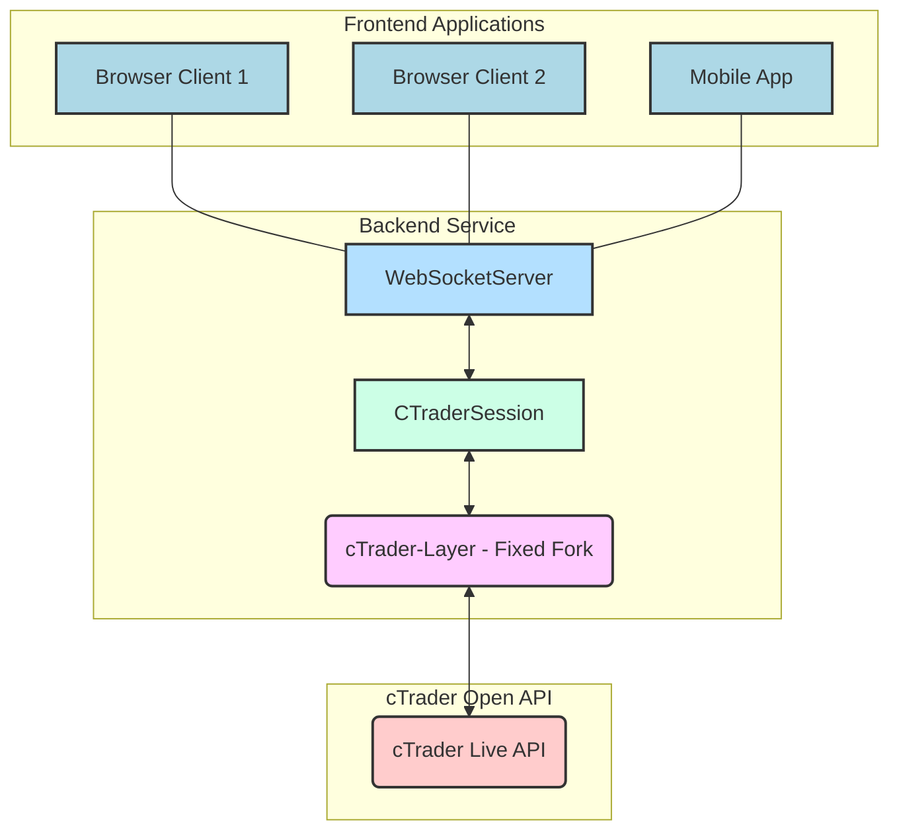

# Backend Architecture Documentation for cTrader Tick Streamer

## Overview
This document describes the architecture of the real-time cTrader Tick Streamer backend. The primary goal of this service is to provide a lean, high-performance, and reliable conduit for cTrader Open API tick data to various frontend applications. It prioritizes simplicity, maintainability, and efficient resource utilization.

## Core Principles

*   **Modularity:** Clear separation of concerns into distinct modules.
*   **Event-Driven:** Components communicate primarily through events, promoting decoupling.
*   **Resilience:** Built-in mechanisms for reconnection and graceful error handling in the `CTraderSession`.
*   **Performance:** Designed for high-throughput data streaming with minimal overhead, particularly with dynamic subscription management.
*   **Simplicity:** Easy to understand, debug, and extend.

## High-Level Architecture

The backend service comprises three main layers:

1.  **cTrader Communication Layer (cTrader-Layer):** Handles the low-level cTrader Open API protocol. This is the forked and fixed `@reiryoku/ctrader-layer` library.
2.  **cTrader Session Management Layer (CTraderSession):** Manages the application-level logic for the cTrader connection, authentication, heartbeats, and a comprehensive list of all available symbols. It emits events reflecting its connection state.
3.  **WebSocket Server Layer (WebSocketServer):** Provides the external interface for frontend clients, maintains the unified backend status, broadcasts status updates and tick data, and dynamically manages cTrader API subscriptions based on client demand.

## Component Breakdown

### 1. `cTrader-Layer` (Forked Library - `ctrader_tick_backend/cTrader-Layer/`) 
This is the patched version of the `@reiryoku/ctrader-layer` NPM package. It's responsible for:

*   **TLS Connection:** Establishing and maintaining a secure TLS socket connection to cTrader.
*   **Protocol Encoding/Decoding:** Handling the low-level protobuf serialization and deserialization of cTrader messages.
*   **Message Dispatching:** Emitting events (by numeric `payloadType`) for incoming cTrader messages.
*   **Bug Fixes:** Contains the critical fixes that enable correct `payloadType` resolution for both sending commands (PascalCase names) and listening to events (SCREAMING_SNAKE_CASE enum names).

**Key Files:**
*   `build/entry/node/main.js`: The main entry point for the compiled library.
*   `src/core/protobuf/CTraderProtobufReader.ts`: Contains the `resolveIdentifierToPayloadType` method, which is the core of our fix, correctly mapping string identifiers to numeric payload types.
*   `src/core/CTraderConnection.ts`: Manages the raw socket connection and uses `CTraderProtobufReader` for message handling.

### 2. `CTraderSession` (`ctrader_tick_backend/CTraderSession.js`) 
This module wraps the `cTrader-Layer` and provides application-level logic for interacting with the cTrader API.

**Responsibilities:**
*   **Authentication:** Handles the `ProtoOAApplicationAuthReq` and `ProtoOAAccountAuthReq` flow.
*   **Heartbeats:** Sends `ProtoHeartbeatEvent` messages periodically to keep the connection alive (configurable interval).
*   **Reconnection Logic:** Implements exponential backoff (or similar) to attempt reconnection if the cTrader connection drops.
*   **Comprehensive Symbol Listing:** Fetches and maintains a complete list of all tradable symbols from cTrader (name-to-ID mappings) in the `availableSymbols` property.
*   **Subscription Management:** Manages `ProtoOASubscribeSpotsReq` and `ProtoOAUnsubscribeSpotsReq` requests directly to cTrader.
*   **Event Emission:** Emits high-level events reflecting the cTrader connection state (`'connected'` with available symbols, `'disconnected'`, `'error'`) and incoming ticks (`'tick'`).

**Key Interactions:**
*   Communicates directly with the `cTrader-Layer` using its `sendCommand` method and listens to its raw `payloadType` events.
*   Reads cTrader API credentials from `process.env`.

### 3. `WebSocketServer` (`ctrader_tick_backend/WebSocketServer.js`) 
This module is responsible for handling all client-facing WebSocket communications. It acts as the central hub for frontend-backend data exchange and manages the overall backend status.

**Responsibilities:**
*   **Client Management:** Manages connected WebSocket clients and their individual subscription sets.
*   **Unified Status Management:** Maintains the `currentBackendStatus` property, which reflects the combined state of the WebSocket server and the `CTraderSession` (states: `disconnected`, `ws-connecting`, `ws-open`, `ctrader-connecting`, `connected`, `error`). This status is updated based on WebSocket server events (`listening`, `error`) and `CTraderSession` events (`connected`, `disconnected`, `error`).
*   **Status Broadcasting:** Broadcasts the `currentBackendStatus` to all connected clients whenever it changes via a `status` message. Also sends the `currentBackendStatus` to a new client upon receiving their initial `connect` message.
*   **Dynamic Backend Subscriptions:** Aggregates client subscription requests (`subscribe` messages). It only tells `CTraderSession` to subscribe to a symbol from the cTrader API if at least one client is actively subscribed to it. It tells `CTraderSession` to unsubscribe when the last client interested in a symbol disconnects or unsubscribes.
*   **Tick Broadcasts:** Receives `tick` events from `CTraderSession` and efficiently broadcasts them *only* to relevant subscribed clients.
*   **Client Commands:** Processes `"connect"`, `"subscribe"`, `"unsubscribe"`, `"ping"`, and `"getSubscriptions"` messages from frontend clients.
*   **Dynamic Port:** Binds to `process.env.PORT` (or a fallback), compatible with IDX's dynamic port assignment.

**Key Interactions:**
*   Listens for high-level events (`'tick'`, `'connected'`, `'disconnected'`, `'error'`) emitted by `CTraderSession` to update its internal status and broadcast to clients.
*   Calls `subscribeTicks` and `unsubscribeTicks` methods on `CTraderSession` based on aggregated client subscription demand.

### 4. Main Application (`ctrader_tick_backend/server.js`) 
This is the entry point of the backend service. It orchestrates the startup and shutdown of the other modules and initiates the cTrader session connection.

**Responsibilities:**
*   **Initialization:** Instantiates `CTraderSession` and `WebSocketServer`.
*   **Startup Flow:** Calls `session.connect()` to initiate the connection process for `CTraderSession` as soon as the backend server starts.
*   **Process Management:** Handles `SIGINT` for graceful shutdown, ensuring all connections are properly closed.
*   **Environment Variables:** Loads environment variables using `dotenv`.

## Data Flow

1.  `server.js` starts, loads environment variables, instantiates `CTraderSession` and `WebSocketServer`, and calls `session.connect()`.
2.  `CTraderSession` attempts to connect to `cTrader-Layer`, which establishes a TLS connection to cTrader API. `CTraderSession` emits status events (`disconnected` -> `ctrader-connecting`).
3.  `WebSocketServer` listens to `CTraderSession` status events and updates its `currentBackendStatus`, broadcasting `status` messages to any already connected clients.
4.  `CTraderSession` authenticates with cTrader API using credentials from `.env`. It then loads all `availableSymbols` and starts sending heartbeats. It emits a `'connected'` event with the list of symbols.
5.  `WebSocketServer` receives the `'connected'` event, updates `currentBackendStatus` to `connected`, stores `availableSymbols`, and broadcasts a `status` message (`{ status: 'connected', availableSymbols: [...] }`) to all connected clients.
6.  Frontend clients connect to `WebSocketServer`. `WebSocketServer`'s `handleConnection` is triggered.
7.  The frontend sends a `connect` message to the `WebSocketServer`.
8.  `WebSocketServer` receives the `connect` message in `handleMessage` and sends the `currentBackendStatus` (which is now `connected` with symbols) back to the client via a `status` message.
9.  Frontend clients receive the `connected` status and `availableSymbols` list and update their UI.
10. Frontend clients send `"subscribe"` messages to `WebSocketServer` for desired symbols.
11. `WebSocketServer` updates its internal `clientSubscriptions` and `backendSubscriptions` counts. If a symbol's count goes from 0 to 1, `WebSocketServer` calls `CTraderSession.subscribeTicks()` for that symbol.
12. `CTraderSession` sends `ProtoOASubscribeSpotsReq` to `cTrader-Layer`, which forwards it to cTrader API.
13. cTrader API starts streaming `PROTO_OA_SPOT_EVENT` messages to `cTrader-Layer`.
14. `cTrader-Layer` decodes `PROTO_OA_SPOT_EVENT` and emits it.
15. `CTraderSession` listens for these events, processes them into a cleaner `tick` object, and emits its own `'tick'` event.
16. `WebSocketServer` listens for `CTraderSession`'s `'tick'` events.
17. `WebSocketServer` broadcasts the `tick` data *only* to clients in its `clientSubscriptions` that are subscribed to that specific symbol via a `tick` message.
18. When a client sends `"unsubscribe"`, `WebSocketServer` decrements the symbol's `backendSubscriptions` count. If the count reaches 0, `WebSocketServer` calls `CTraderSession.unsubscribeTicks()` for that symbol.

## Error Handling & Resilience

*   **cTrader Connection:** `CTraderSession` includes automatic reconnection logic with a delay on unexpected disconnections or authentication failures, ensuring the backend tries to recover and emits `disconnected` or `error` events.
*   **API Errors:** `CTraderSession` logs errors received from the cTrader API (e.g., `CH_CLIENT_AUTH_FAILURE`) and emits an `error` event.
*   **WebSocket Errors:** `WebSocketServer` logs client-side WebSocket errors and server-side WebSocket errors, and updates the `currentBackendStatus` to `error` if a critical server error occurs.
*   **Graceful Shutdown:** `server.js` handles `SIGINT` to ensure `CTraderSession` and `WebSocketServer` are properly closed, preventing dangling connections.

## Configuration

Environment variables are used for configuration, stored in `ctrader_tick_backend/.env`:

*   `CTRADER_CLIENT_ID`, `CTRADER_CLIENT_SECRET`, `CTRADER_ACCESS_TOKEN`, `CTRADER_ACCOUNT_ID`: Your cTrader API credentials.
*   `HOST`, `PORT`: cTrader API server host and port (e.g., `live.ctraderapi.com`, `5035`).
*   `WS_PORT`: The internal port for the WebSocket server (e.g., `8080`). This can be overridden by IDX's `PORT` environment variable.

## Dependencies

*   `@reiryoku/ctrader-layer`: Our locally fixed version for robust cTrader API communication.
*   `ws`: For efficient WebSocket server functionality.
*   `dotenv`: For securely loading environment variables.
*   `events`: Node.js built-in for event handling.

## Development & Deployment Notes

*   **IDX Compatibility:** The backend is designed to be fully compatible with IDX, utilizing `process.env.PORT` for dynamic port assignment and binding to `0.0.0.0` for container accessibility.
*   **Production Deployment:** For production, ensure environment variables are managed securely (e.g., Kubernetes secrets, cloud environment variables) and consider using a process manager (e.g., PM2) for continuous operation and automatic restarts.

---
